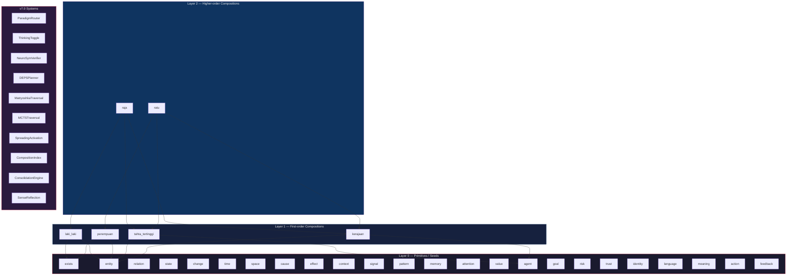
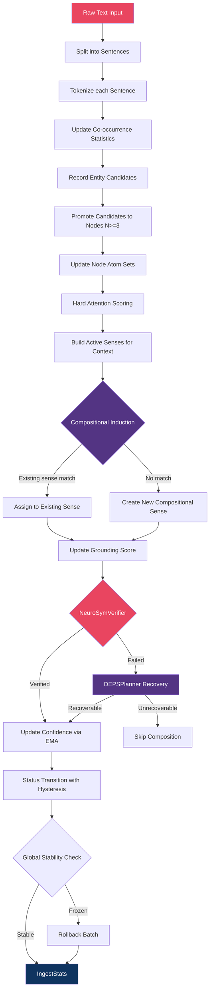
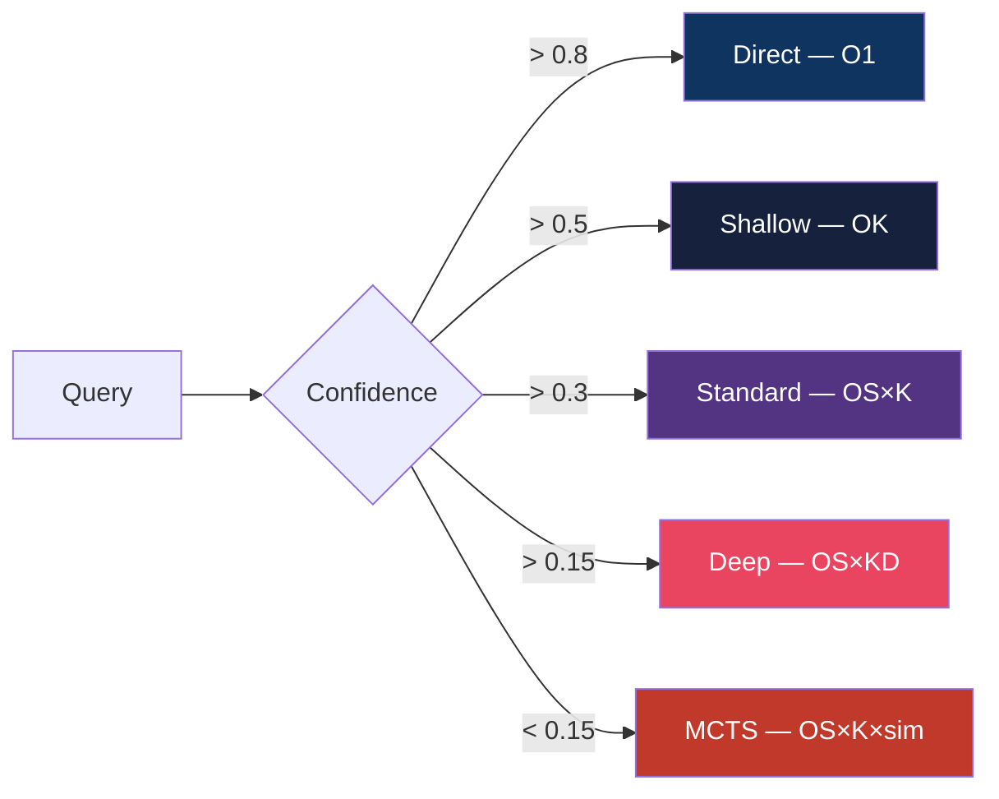
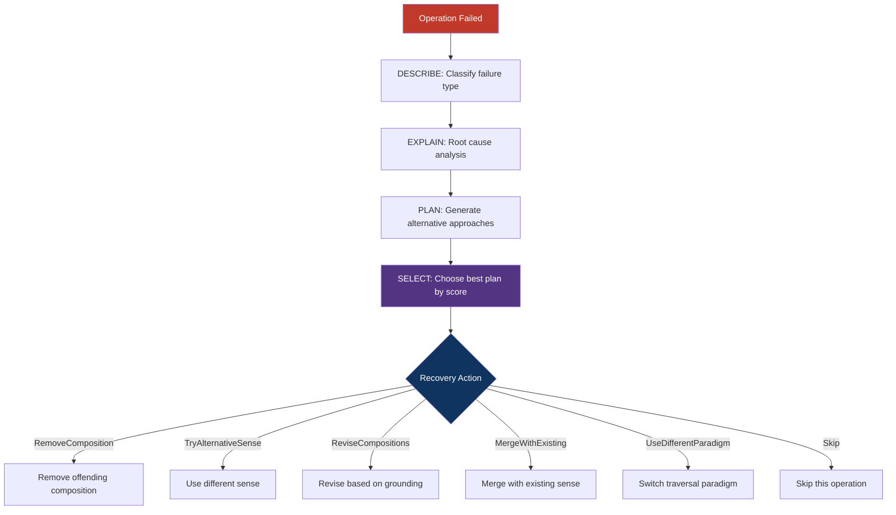
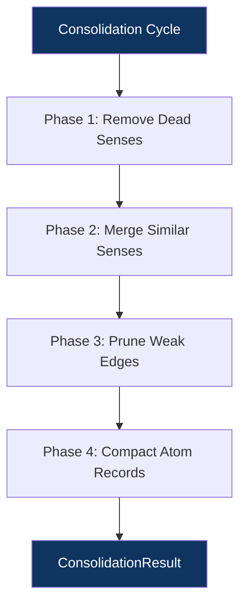
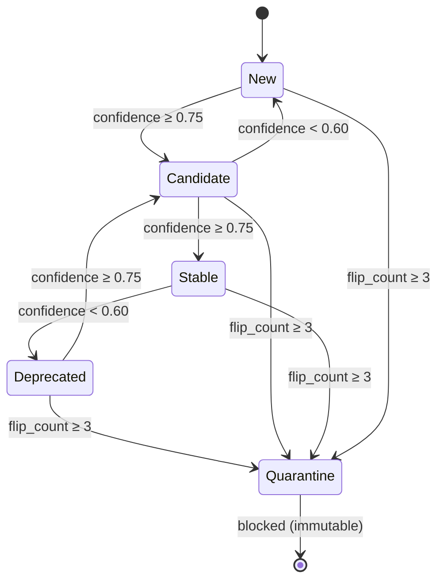
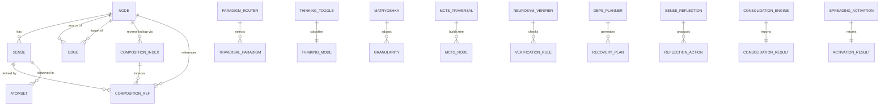
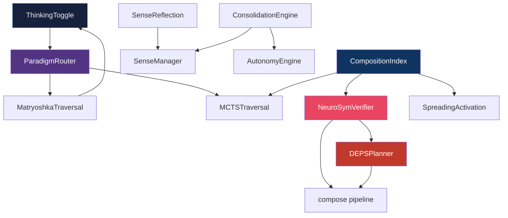

# RSVS Architecture — Compositional Symbolic Meaning

> Technical reference for the Relational Symbolic Vocabulary System, v7.0 Compositional Architecture

---

## Table of Contents

1. [Overview](#1-overview)
2. [Core Concepts](#2-core-concepts)
3. [The Compositional Principle](#3-the-compositional-principle)
4. [Layer Architecture](#4-layer-architecture)
5. [Ingest Pipeline](#5-ingest-pipeline)
6. [Advanced Traversal](#6-advanced-traversal)
7. [Verification & Recovery](#7-verification--recovery)
8. [Maintenance Systems](#8-maintenance-systems)
9. [Grounding](#9-grounding)
10. [Autonomy Engine](#10-autonomy-engine)
11. [Data Model](#11-data-model)
12. [API Reference](#12-api-reference)
13. [Performance Characteristics](#13-performance-characteristics)

---

## 1. Overview

### What RSVS Is

The Relational Symbolic Vocabulary System (RSVS) is a compositional symbolic meaning engine. Its fundamental thesis is that **meaning is structural, not statistical**. When we say that "raja" (king) and "ratu" (queen) are related, RSVS doesn't express this as a cosine similarity between two opaque vectors — it says they share two out of three compositions (tahta_tertinggi, kerajaan) and differ in exactly one (laki_laki vs. perempuan). Every dimension of meaning can be traced back to its constituent senses, and every relationship between concepts can be explained as shared or differing compositions.

RSVS builds a structured knowledge graph where each node (an ID representing a word or entity) can have multiple senses, and each sense is defined by its compositions — pairs of (ID, sense_id) that collectively form the meaning of that sense. This recursive structure means that meaning in RSVS is never atomic beyond the seed layer; it is always a composition of other meanings already in the system. The graph is constructed incrementally from raw text through an ingest pipeline that detects entities, scores attention, induces senses with compositions, verifies grounding, and manages node lifecycles autonomously.

### What RSVS Is Not

RSVS is **not a replacement for Transformer architecture**. It is an interpretation layer ON TOP of it. Transformers produce dense vector representations — powerful but opaque. RSVS transforms those abstract numbers into symbolically referenceable representations where every dimension of meaning can be traced back to its constituent senses. You can use RSVS alongside any Transformer model: the Transformer handles pattern recognition at scale, and RSVS provides the symbolic traceability layer that makes the results interpretable, auditable, and compositional.

RSVS is also not a traditional knowledge graph with hand-curated ontologies. All meaning in RSVS emerges from data through the ingest pipeline. The only human-specified components are the 24 epistemological seed atoms that form the axiomatic foundation of the system. Everything above Layer 0 is learned.

### Key Insight

The key insight of RSVS can be stated in one sentence: **Every sense is formed by other senses.** This principle has profound consequences. It means that similarity between concepts is structural — you can point to exactly which compositions they share and which they differ on. It means that substitution analysis is possible — you can identify the precise swap that transforms one concept into another. And it means that meaning is fully traceable — you can follow the chain of compositions from any high-level concept all the way down to the primitive seed atoms.

### What's New in v7.0

v7.0 introduces ten major subsystems that make RSVS adaptive, self-correcting, and query-efficient:

| Module | Purpose |
|--------|---------|
| **ParadigmRouter** | 5-level query routing: Direct → Shallow → Standard → Deep → MCTS |
| **ThinkingToggle** | NON_THINKING vs THINKING mode for adaptive traversal depth |
| **MatryoshkaTraversal** | Multi-granularity traversal (Quarter → Half → ThreeQuarters → Full) |
| **MCTSTraversal** | UCB1 tree search with structural value and backtracking |
| **NeuroSymVerifier** | 5 verification rules wired into compose() pipeline |
| **DEPSPlanner** | Describe-Explain-Plan-Select structured failure recovery |
| **SenseReflection** | CONFIRM/REVIEW/REVISE/RETIRE self-evaluation loop |
| **ConsolidationEngine** | 4-phase periodic cleanup (remove dead, merge similar, prune weak, compact) |
| **SpreadingActivation** | Energy-based activation along composition edges with per-hop decay |
| **CompositionIndex** | O(1) reverse lookup from CompositionRef → dependent nodes |

---

## 2. Core Concepts

### ID (Identifier)

An ID represents a word or entity in the system. Internally, it is a `u32` integer (`NodeId`) for compact storage and fast lookup. Each ID has a canonical label (e.g., "raja") and a surface form with language tag (e.g., "raja@id"). IDs are the vertices of the knowledge graph — they are what edges connect and what senses belong to.

```rust
pub type NodeId = u32;
```

### Sense

A sense is one meaning of an ID. One ID can have multiple senses depending on context. For example, the ID "bank" might have Sense 0 (financial institution) and Sense 1 (river edge). Senses are not standalone entities — each sense is formed by a set of compositions that define what it means. The `SenseManager` for each node tracks all of its senses, manages their lifecycle (Fragile → Mature → Merged), and handles the assignment of new contexts to existing senses.

```rust
pub struct Sense {
    pub id: SenseId,                          // Index within the parent node
    pub compositions: Vec<CompositionRef>,    // The structural definition
    pub layer: u32,                           // Compositional depth
    pub contexts: Vec<AtomSet>,               // Observational evidence
    pub coherence: f32,                       // Internal consistency
    pub grounding: GroundingEvidence,         // Verification against evidence (v7.0)
    // ...
}
```

### CompositionRef

A `CompositionRef` is the fundamental unit of compositional meaning. It is a pair of `(NodeId, SenseId)` — a reference to a specific sense of a specific node. When sense S of node X is composed from `[(A, s1), (B, s2), (C, s3)]`, it means: "X in sense S means what A means in sense s1, AND what B means in sense s2, AND what C means in sense s3."

```rust
pub struct CompositionRef {
    pub node_id: NodeId,    // The target node
    pub sense_id: SenseId,  // The target sense within that node
}
```

Example: The compositions of "raja" sense 0 are `[(tahta_tertinggi, 0), (laki_laki, 0), (kerajaan, 0)]`. The compositions of "ratu" sense 0 are `[(tahta_tertinggi, 0), (perempuan, 0), (kerajaan, 0)]`.

### Layer

Layer tracks compositional depth. Layer 0 nodes are primitives (seeds or first-order entities). Layer N nodes have at least one composition that references a Layer N-1 sense. Layers form a natural hierarchy:

| Layer | Contents | Example |
|-------|----------|---------|
| 0 | Seed atoms, primitive entities | exists, entity, laki_laki |
| 1 | First-order compositions from text | tahta_tertinggi (highest throne) |
| 2+ | Higher-order recursive compositions | raja (composed from Layer 1 senses) |

```rust
pub fn compute_layer(&self, composition_ids: &[NodeId]) -> u32 {
    if composition_ids.is_empty() { return 0; }
    let max_layer = composition_ids.iter()
        .filter_map(|&id| self.graph.get_node(id))
        .map(|n| n.semantic.layer)
        .max()
        .unwrap_or(0);
    max_layer + 1
}
```

---

## 3. The Compositional Principle

### Every Sense Is Formed by Other Senses

The foundational principle of RSVS is that no sense stands alone. Every sense of an ID is formed by other senses already in the system, recursively. This is not a statistical claim (e.g., "these words co-occur") but a structural one: the meaning of a sense is literally the conjunction of the meanings of its composition targets. If you remove a composition, the meaning changes in a precise, traceable way.

### The raja/ratu Example

Consider the Bahasa Indonesia words "raja" (king) and "ratu" (queen). In RSVS:

```
raja.sense_0.compositions = [
    (tahta_tertinggi, 0),   // highest throne
    (laki_laki, 0),         // male
    (kerajaan, 0)           // kingdom
]

ratu.sense_0.compositions = [
    (tahta_tertinggi, 0),   // highest throne
    (perempuan, 0),         // female
    (kerajaan, 0)           // kingdom
]
```

These two concepts share 2 out of 3 compositions, giving a structural similarity score of 2/3 ≈ 0.667. The substitution analysis reveals that replacing `(laki_laki, 0)` with `(perempuan, 0)` transforms raja into ratu. This is not a statistical coincidence — it is the precise structural reason why these words are related.

### Substitution Analysis

Substitution analysis is the operation that identifies exactly which compositions need to change to transform one concept into another. It goes beyond saying "these concepts are similar" — it says *why* they are similar and *what differs*. The `composition_diff` method returns `(only_in_self, only_in_other)`, and substitution analysis pairs these differing compositions to produce a list of precise substitutions.

```rust
pub fn composition_diff(&self, other: &Sense)
    -> (Vec<CompositionRef>, Vec<CompositionRef>)
```

For raja and ratu:
- `only_in_self` = `[(laki_laki, 0)]`
- `only_in_other` = `[(perempuan, 0)]`
- Substitution: `(laki_laki, 0)` → `(perempuan, 0)`

### Why This Matters

Traditional embeddings tell you that raja and ratu have cosine similarity 0.87. RSVS tells you they share tahta_tertinggi and kerajaan, differ in laki_laki vs. perempuan, and that this single substitution accounts for their entire semantic difference. This level of precision enables:

1. **Explainable AI**: Every relationship has a clear, auditable reason
2. **Controlled generation**: Swapping compositions produces semantically coherent variants
3. **Error detection**: If a composition is incorrect, NeuroSymVerifier will flag it
4. **Cross-lingual reasoning**: The same structural patterns hold across languages

---

## 4. Layer Architecture



### Layer 0: Primitives / Seeds

The 24 epistemological seed atoms form the axiomatic foundation of RSVS. These nodes are created at system bootstrapping and are **immutable**: they have confidence = 1.0, Tier = Tier1, status = Stable, and cannot be removed, demoted, or modified. They represent the most fundamental categories of human knowledge — existential, spatiotemporal, cognitive, agentic, and linguistic primitives.

| Category | Seeds |
|----------|-------|
| Existential | `exists`, `entity`, `relation`, `state`, `change` |
| Spatiotemporal | `time`, `space`, `cause`, `effect`, `context` |
| Cognitive | `signal`, `pattern`, `memory`, `attention`, `value` |
| Agentic | `agent`, `goal`, `risk`, `trust`, `identity` |
| Linguistic | `language`, `meaning`, `action`, `feedback` |

All seed nodes have `layer = 0`, `compression_state = Raw`, and empty composition lists. They are the ground truth from which all higher-order meanings are recursively constructed.

### Layer 1: First-Order Compositions

When text is first ingested, the system promotes frequently occurring tokens to nodes. These first-order entities (like "laki_laki", "perempuan", "tahta_tertinggi") start at Layer 0 as raw nodes but can be promoted to Layer 1 when their senses acquire compositions. A Layer 1 node has at least one sense whose compositions reference only Layer 0 nodes.

The transition from Layer 0 to Layer 1 happens during sense induction: when a new sense is created for a node, the system identifies which `(ID, sense_id)` pairs are active in the context and uses them as the compositions. If any of those targets are Layer 0, the new sense is at least Layer 1.

### Layer 2+: Higher-Order Recursive Compositions

Layer 2 and above represent concepts that are composed from other composed concepts. "Raja" is a Layer 2 concept because its compositions reference Layer 1 entities (tahta_tertinggi, laki_laki, kerajaan). This recursive composition can continue indefinitely — Layer 3 concepts reference Layer 2 senses, and so on.

The layer of a new node is computed as `max(layer of all composition targets) + 1`. This ensures that the layer always reflects the maximum depth of compositional recursion. If a node has compositions referencing both Layer 0 and Layer 3 nodes, it is Layer 4.

---

## 5. Ingest Pipeline

The ingest pipeline is the primary mechanism by which raw text is transformed into structured compositional knowledge. It runs as a single atomic operation on the Rust core, producing new nodes, senses, compositions, edges, and confidence updates.

### Pipeline Flow



### Step-by-Step Walkthrough

**Step 1: Tokenize.** Raw text is split into sentences (on `.!?` boundaries) and each sentence is tokenized: lowercase, filter tokens shorter than 3 characters, remove pure digits, remove stopwords. This produces `Vec<Vec<String>>` — a list of sentences, each a list of tokens.

**Step 2: Co-occurrence Statistics.** For each sentence, `CoocStats::ingest_sentence(tokens)` updates unigram counts, bigram pair counts, and total token/sentence counters. These statistics are used later for NPMI computation and attention scoring.

**Step 3: Entity Detection.** Each token is recorded by the `EntityDetector` with a grounding flag (whether the token is groundable to any seed atom via substring match). Tokens that appear in ≥ N sentences (default: 3) AND are groundable are promoted to nodes.

**Step 4: Node Promotion.** For each qualifying entity candidate that doesn't already exist in the graph, a new `Node` is created with `tier = Tier2`, `confidence = 0.50`, `status = Candidate`, `layer = 0`. The node is registered with the autonomy engine and a `SenseManager` is created for it.

**Step 5: Atom Set Update.** For each promoted (and existing) node, co-occurrence statistics are used to build/update the node's atom set — the top-N most strongly co-occurring other nodes. This also updates the node's `compression_state` to `Compressed` and creates/updates `Learned` edges.

**Step 6: Attention Scoring.** For each sentence, the hard-attention mechanism scores all (token, candidate) pairs using the formula `score = α·NPMI + β·Jaccard + γ·cooc` and selects top-k candidates per token. This produces a sparse, deterministic, interpretable attention map.

**Step 7: Active Sense Resolution.** For each token in the sentence, the system determines which sense of each context node is currently active (via `active_sense_for_node`). This produces a list of `(NodeId, SenseId)` pairs — the active senses in the current context.

**Step 8: Sense Induction with Compositions.** For each token that has an ID in the graph, the active senses from Step 7 are used as the compositions of a new (or existing) sense. The `SenseManager::induce_sense` method either assigns the context to an existing sense whose compositions match well enough (composition overlap ≥ θ_assign), or creates a new compositional sense with the induced compositions.

**Step 9: Grounding Update.** After a sense is assigned or created, the grounding score is updated based on whether the context confirms or contradicts the compositions. A confirming context (high overlap with composition node IDs) boosts the grounding score; a contradicting context (low overlap) penalizes it.

**Step 10: Verification & Recovery (v7.0).** The NeuroSymVerifier checks compositions against 5 structural rules. If any rule fails, the DEPSPlanner generates recovery plans with estimated success rates. Recoverable compositions proceed; unrecoverable ones are skipped.

**Step 11: Confidence Update.** The autonomy engine updates the node's confidence using EMA: `new_conf = (1 - η) · old_conf + η · (freq × coherence)`. Energy constraints limit single-step drops, and the status lifecycle transitions (New → Candidate → Stable → Deprecated) are attempted with hysteresis.

**Step 12: Global Stability Check.** After all sentences are processed, the total confidence delta across the batch is checked. If it exceeds the threshold, the entire batch is rolled back to the pre-batch snapshot.

### Sense Proliferation Control

Without controls, the system could create an unbounded number of senses. RSVS employs multiple mechanisms to prevent sense proliferation:

1. **Candidate pruning**: Before scoring all senses, only senses with sufficient core overlap are considered. The threshold is `m = ceil(ln(|senses| + 1))` — it grows logarithmically with the number of senses.

2. **Merge mechanism**: Mature senses with composition overlap ≥ `theta_merge` (default: 0.50) and minimum context count ≥ `n_min_mature` (default: 5) are automatically merged.

3. **Fragile pruning**: Senses with only one context (status: Fragile) that have been inactive for ≥ `k_fragile` (default: 30) global contexts AND have low grounding scores are automatically deleted.

4. **Assignment preference**: The system preferentially assigns contexts to existing senses rather than creating new ones.

---

## 6. Advanced Traversal

v7.0 introduces a layered traversal architecture that dynamically selects the cheapest strategy that will succeed for a given query. The core insight: not every query needs deep traversal. Simple factual queries should use shallow mode for speed; complex reasoning queries should use deep mode for accuracy.

### 6.1 ThinkingToggle

The `ThinkingToggle` classifies each query into `NON_THINKING` or `THINKING` mode based on structural complexity signals. This is the first level of adaptation — before the ParadigmRouter selects a specific traversal strategy.

#### ComplexitySignal

Five signals determine the thinking mode:

| Signal | Threshold | Meaning |
|--------|-----------|---------|
| `n_context_atoms` | ≥ 3 | More context = more complex |
| `n_senses` | ≥ 2 | Multi-sense = needs disambiguation |
| `target_layer` | ≥ 1 | Compositional = deeper traversal needed |
| `is_compositional` | true | Multi-hop references detected |
| `domain_complexity` | > 0.5 | Domain-specific difficulty |

```rust
pub struct ComplexitySignal {
    pub n_context_atoms: usize,
    pub n_senses: usize,
    pub target_layer: u32,
    pub is_compositional: bool,
    pub domain_complexity: f32,
}
```

#### Classification Rule

A query is classified as THINKING if **≥ 2 out of 5** signals exceed their thresholds. This prevents over-sensitivity to any single signal while ensuring genuinely complex queries get deep traversal.

#### Traversal Adjustment

| Mode | Depth Multiplier | τ Adjustment | Effect |
|------|-----------------|--------------|--------|
| NON_THINKING | 0.5 | +0.05 | Shallower, fewer expansions |
| THINKING | 1.0 | −0.03 | Full depth, broader search |

```rust
pub fn adjust_traversal(&self, mode: &ThinkingMode, base: &TraversalConfig) -> TraversalConfig {
    let (depth_mult, relevance_adjustment) = match mode {
        ThinkingMode::NonThinking => (0.5, 0.05),
        ThinkingMode::Thinking => (1.0, -0.03),
    };
    // ...apply to base config
}
```

A `force_mode` override (-1 = auto, 0 = NON_THINKING, 1 = THINKING) allows per-domain or per-query manual control.

### 6.2 ParadigmRouter

The `ParadigmRouter` selects the lightest traversal strategy that will succeed for a given query. Inspired by Losion's ParadigmRouter which routes queries to optimal reasoning paradigms, the RSVS version operates on compositional structure rather than natural language.

#### Five-Level Routing



| Paradigm | Confidence | Depth | τ | Cost | Use Case |
|----------|-----------|-------|---|------|----------|
| **Direct** | > 0.8 | 0 | 0.99 | O(1) | Single sense, high confidence |
| **Shallow** | > 0.5 | 1 | 0.20 | O(K) | Few atoms, single sense |
| **Standard** | > 0.3 | ≤ 3 | base | O(S×K) | Multiple senses, moderate |
| **Deep** | > 0.15 | full | base−0.03 | O(S×K^D) | Complex disambiguation |
| **MCTS** | < 0.15 | 4 | 0.05 | O(S×K×sim) | Very complex, multi-hop |

#### Three-Signal Routing

1. **Confidence signal**: Grounding score of the active sense — determines baseline paradigm
2. **Structural signal**: ThinkingToggle classification — THINKING mode upgrades to at least Standard
3. **Domain calibration**: Per-domain success rates — if a lighter paradigm has >50% success for this domain, prefer it

```rust
pub fn route(&self, confidence: f32, signal: &ComplexitySignal, domain: usize) -> TraversalParadigm {
    // Step 1: Confidence-based baseline
    let baseline = /* map confidence to paradigm */;
    // Step 2: Structural adjustment from ThinkingToggle
    let structural_adjusted = match toggle.classify(signal) {
        ThinkingMode::NonThinking => baseline,
        ThinkingMode::Thinking => baseline.max(Standard),
    };
    // Step 3: Domain calibration — prefer lighter paradigm with >50% success
    /* check domain_calibration hashmap */
    structural_adjusted
}
```

Domain calibration is learned: `record_success(domain, paradigm)` and `record_failure(domain, paradigm)` update per-domain success counts. After 5+ observations in a domain, the router uses the empirical success rates to prefer lighter paradigms that work.

### 6.3 MatryoshkaTraversal

The `MatryoshkaTraversal` provides multi-granularity traversal inspired by MatFormer-style nested inference. Different granularity levels produce traversals of different depths — like Russian nesting dolls.

#### Granularity Levels

| Granularity | Depth Multiplier | τ Adjustment | Use Case |
|-------------|-----------------|--------------|----------|
| Quarter (0.25) | 0.25 | +0.10 | Simple factual queries |
| Half (0.50) | 0.50 | +0.05 | Disambiguation queries |
| ThreeQuarters (0.75) | 0.75 | 0.00 | Complex compositional queries |
| Full (1.00) | 1.00 | −0.03 | Thorough analysis |

Granularity is selected automatically via `Granularity::from_complexity(signal)`, which scores signals on a 0–9 scale:

```
score 0–1  → Quarter
score 2–3  → Half
score 4–5  → ThreeQuarters
score 6+   → Full
```

#### Variable-Depth Branching

The key Matryoshka innovation is that different branches of the traversal tree can stop at different depths. High-confidence composition branches continue deeper; low-confidence branches are pruned early. This produces a non-uniform traversal tree where resources are concentrated where they matter most.

```rust
// Only recurse into high-confidence branches
if child_confidence >= config.tau_relevance {
    let child_result = self.traverse_recursive(/* ... */);
    scored_atoms.extend(child_result.scored_atoms);
} // else: prune this branch early
```

### 6.4 MCTSTraversal

The `MCTSTraversal` provides AlphaZero-style tree search for the most complex queries. It uses structural scores (grounding × coherence) as the value function and composition frequency as the policy function, with UCB1 balancing exploration and exploitation.

#### UCB1 Selection

```
UCB1(child) = Q(child) + c_puct × sqrt(N(parent)) / N(child)
```

Where:
- `Q(child)` = average value from all simulations through this child
- `N(parent)` = visit count of the parent node
- `N(child)` = visit count of the child node
- `c_puct` = exploration constant (default: 1.414)
- Unvisited children get `UCB1 = ∞` (always explore first)

#### Structural Value Function

Instead of neural networks, MCTS uses `grounding × coherence` as the value of each node:

```rust
fn evaluate_node(&self, node_id: NodeId, sense_idx: usize, senses: &HashMap<NodeId, SenseManager>) -> f32 {
    senses.get(&node_id)
        .and_then(|sm| sm.senses.get(sense_idx))
        .map(|sense| sense.grounding.score() * sense.coherence)
        .unwrap_or(0.0)
}
```

This is the structural quality signal: well-grounded, coherent compositions score high; poorly grounded or incoherent ones score low.

#### Backtracking

If a simulation encounters a node with value < `min_value` (default: 0.5), the path is abandoned with a penalty: `value *= backtrack_threshold` (default: 0.3). This prevents the search from wasting simulations on low-quality branches.

#### MCTS Configuration

| Parameter | Default | Meaning |
|-----------|---------|---------|
| `max_simulations` | 10 | Number of simulations per query |
| `c_puct` | 1.414 | Exploration vs exploitation |
| `backtrack_threshold` | 0.3 | Confidence drop for backtracking |
| `max_depth` | 4 | Maximum depth per simulation |
| `min_value` | 0.5 | Minimum value to continue |

#### MCTS Result

The result is compatible with the standard `ContextQueryResult` API, with additional fields:

```rust
pub struct MCTSResult {
    pub context_query_result: ContextQueryResult,  // Standard API
    pub simulations_run: usize,                     // Number of simulations
    pub best_path: Vec<(NodeId, usize)>,            // Best path: (node, sense) pairs
}
```

---

## 7. Verification & Recovery

v7.0 wires verification and recovery directly into the compose() pipeline. Every composition is verified against structural rules before being accepted, and failures generate structured recovery plans rather than just errors.

### 7.1 NeuroSymVerifier

The `NeuroSymVerifier` checks compositions against 5 structural invariants. Unlike Losion's neural verification approach, RSVS uses deterministic structural rules — no neural networks, no learned weights, no non-determinism.

#### Five Verification Rules

| Rule | Weight | Threshold | Type | Description |
|------|--------|-----------|------|-------------|
| `no_self_reference` | 1.0 | 1.0 | Binary | Compositions must not reference the same node they define |
| `layer_consistency` | 0.8 | 0.5 | Soft | Compositions should reference equal or lower layers |
| `grounding_threshold` | 0.7 | 0.5 | Soft | Composition targets should be grounded |
| `frequency_threshold` | 0.5 | 0.3 | Soft | Composition targets should have sufficient frequency |
| `no_circular_chain` | 1.0 | 1.0 | Binary | Transitive closure must not loop back to the node |

Binary rules (weight = 1.0, threshold = 1.0) require absolute compliance — any violation is a hard failure. Soft rules allow partial compliance — the score is the fraction of compositions that satisfy the rule.

#### Verification Status

```rust
pub enum VerificationStatus {
    Verified,                    // All rules passed
    Partial { passed: usize, failed: usize },  // Some rules failed
    Failed,                      // Verification failed
    Unsure,                      // Need more data
    NeedsRevision,               // Score too low, revision needed
}
```

The overall status is computed from a weighted average of rule scores:

```
weighted_score = Σ(rule.weight × rule.score) / Σ(rule.weight)

All passed                  → Verified
weighted_score ≥ 0.8        → Partial { passed, failed }
0.3 ≤ weighted_score < 0.8  → NeedsRevision
weighted_score < 0.3        → Failed
```

#### Iterative Verification with Revision

The verifier can attempt up to `max_iterations` (default: 3) revision cycles. On each failure, the worst-scoring composition is removed and verification is re-run:

```rust
pub fn verify_with_revision(&self, node_id: NodeId, sense: &mut Sense, ...) -> (VerificationStatus, Vec<Vec<RuleResult>>) {
    for _ in 0..self.max_iterations {
        let (status, results) = self.verify(node_id, sense, graph, all_senses, config);
        match status {
            VerificationStatus::Verified => return (Verified, all_results),
            VerificationStatus::NeedsRevision | Failed => {
                sense.compositions.pop(); // Remove worst-scoring
                sense.grounding.revision_count += 1;
            }
            _ => return (status, all_results),
        }
    }
}
```

#### Circular Chain Detection

The `detect_circular_chain` method performs a depth-first traversal of composition references, checking whether the transitive closure loops back to the start node:

```rust
fn detect_circular_chain(&self, start_node: NodeId, sense: &Sense, all_senses: &HashMap<NodeId, SenseManager>) -> bool {
    let mut visited = HashSet::new();
    visited.insert(start_node);
    let mut stack: Vec<NodeId> = sense.compositions.iter().map(|c| c.node_id).collect();
    while let Some(current) = stack.pop() {
        if current == start_node { return true; } // Circular chain found
        if visited.contains(&current) { continue; }
        visited.insert(current);
        // Expand compositions of current node
        if let Some(sm) = all_senses.get(&current) {
            if let Some(sense) = sm.senses.first() {
                for comp in &sense.compositions { stack.push(comp.node_id); }
            }
        }
    }
    false
}
```

#### Integration with compose()

In the compose() pipeline, the verifier runs **before** the node is created. Self-reference and circular chain checks are performed on the proposed compositions:

```rust
// In compose():
for comp in &compositions {
    // Self-reference check
    if comp.node_id == existing_id {
        let deps_result = self.deps_planner.analyze(
            &RsvsError::CircularRef { from: existing_id, to: existing_id },
            existing_id,
        );
        let recovery_hint = deps_result.recommended.as_ref().map(|p| p.description.clone());
        return Err(RsvsError::CompositionRejected { reason: format!("Self-reference. Recovery: {}", recovery_hint) });
    }
    // Circular chain check
    if self.detect_composition_cycle(comp.node_id, label) {
        let deps_result = self.deps_planner.analyze(/* ... */);
        return Err(RsvsError::CompositionRejected { reason: format!("Circular chain. Recovery: {}", recovery_hint) });
    }
}
```

### 7.2 DEPSPlanner

The `DEPSPlanner` provides structured recovery from failed operations using the Describe-Explain-Plan-Select pattern. Instead of returning a bare error, it generates recovery plans with estimated success rates.

#### The DEPS Cycle



#### Failure Classification

| FailureType | RsvsError Trigger | Primary Recovery |
|-------------|-------------------|------------------|
| `SelfReference` | `CircularRef { from == to }` | Remove self-referencing composition (95% success) |
| `CircularChain` | `CircularRef { from ≠ to }` | Break cycle by removing weakest composition (85%) |
| `TargetNotFound` | `NodeNotFound` | Create missing target or remove invalid reference (90%) |
| `SenseLimitReached` | — | Force-assign to best matching sense (85%) |
| `InsufficientDivergence` | — | Assign to existing sense (90%) |
| `TraversalLeafReached` | — | Use MCTS for deeper exploration (70%) |
| `LowConfidence` | — | Use different traversal paradigm (65%) |
| `GroundingFailure` | — | Revise compositions (70%) |

#### Plan Scoring

Each recovery plan has a composite score:

```
plan_score = 0.6 × estimated_success_rate + 0.4 × simplicity
```

Plans are sorted by score (best first), and the recommended plan is the highest-scoring one. Destructive plans (those that modify the graph) are flagged with `is_destructive: true` so callers can make informed decisions.

```rust
pub struct RecoveryPlan {
    pub description: String,
    pub action: RecoveryAction,
    pub estimated_success_rate: f32,  // 0.0–1.0
    pub simplicity: f32,              // 0.0–1.0
    pub is_destructive: bool,
}
```

#### Integration with compose()

When the NeuroSymVerifier detects a violation in compose(), the DEPSPlanner is invoked to generate a recovery hint that is included in the error message. This gives the caller actionable information instead of just "operation failed":

```rust
let deps_result = self.deps_planner.analyze(&error, node_id);
let recovery_hint = deps_result.recommended
    .as_ref()
    .map(|p| p.description.clone())
    .unwrap_or_default();
return Err(RsvsError::CompositionRejected {
    reason: format!("... Recovery: {}", recovery_hint),
});
```

---

## 8. Maintenance Systems

v7.0 introduces three maintenance subsystems that run at safe checkpoints (not during active ingestion) to keep the graph clean and efficient.

### 8.1 ConsolidationEngine

The `ConsolidationEngine` performs thorough periodic cleanup, inspired by Losion's EpisodicMemory.consolidate(). It runs at configurable intervals (default: every 50 ingest batches) and is more aggressive than per-node maintenance.

#### Four-Phase Consolidation



**Phase 1: Remove Dead Senses.** Senses that are Fragile + ungrounded + very inactive (inactivity ≥ 2× `k_fragile`) are removed. This is stricter than the per-node `purge_fragile` mechanism.

**Phase 2: Merge Similar Senses.** Senses within the same node with composition overlap ≥ `merge_jaccard_threshold` (default: 0.8) are merged. Limited to `max_merges_per_cycle` (default: 5) to prevent over-merging in a single pass.

**Phase 3: Prune Weak Edges.** Learned edges with weight < `min_edge_weight` (default: 0.02) are removed. Bootstrap and Composition edges are preserved regardless of weight.

**Phase 4: Compact Atom Records.** Autonomy records for nodes with confidence < `tau_remove` are purged. Seed nodes are always preserved.

```rust
pub struct ConsolidationResult {
    pub senses_merged: usize,
    pub senses_removed: usize,
    pub edges_pruned: usize,
    pub atoms_compacted: usize,
}
```

#### Configuration

| Parameter | Default | Meaning |
|-----------|---------|---------|
| `consolidation_interval` | 50 | Run every N batches |
| `merge_jaccard_threshold` | 0.8 | Composition overlap to merge |
| `min_edge_weight` | 0.02 | Minimum edge weight to keep |
| `max_merges_per_cycle` | 5 | Prevent over-merging |
| `compact_atom_records` | true | Whether to compact records |

### 8.2 SenseReflection

The `SenseReflection` engine performs self-evaluation of all senses at safe checkpoints, producing actions based on grounding evidence. Inspired by Losion's ReflectionEngine (Reflexion + Self-Refine patterns), but using structural grounding scores instead of natural language feedback.

#### Reflection Actions

| Action | Trigger | Effect |
|--------|---------|--------|
| **CONFIRM** | Grounding ≥ 0.60 | No action needed — sense is well-grounded |
| **REVIEW** | Grounding 0.20–0.59 | Monitor closely; track consecutive reviews |
| **REVISE** | Grounding < 0.20 OR ≥3 consecutive REVIEWs | Prune least-grounded compositions |
| **RETIRE** | Fragile + ungrounded + inactivity ≥ 100 | Mark for deletion by purge_fragile |

#### Escalation Mechanism

The reflection engine tracks consecutive REVIEW verdicts per sense. If a sense receives ≥ `review_escalation_threshold` (default: 3) consecutive REVIEWs, it is automatically escalated to REVISE. This prevents senses from lingering in a degraded state indefinitely.

```rust
// Escalation: consecutive reviews → revise
GroundingVerdict::NeedsReview => {
    *count += 1;
    if *count >= self.config.review_escalation_threshold {
        self.review_counts.remove(&(node_id, sense_idx));
        ReflectionAction::Revise { node_id, sense_idx }
    } else {
        ReflectionAction::Review { node_id, sense_idx, grounding_score: ... }
    }
}
```

REVISE actions are rate-limited to `max_revise_per_cycle` (default: 3) to prevent catastrophic pruning from a single bad batch. Excess REVISE actions are downgraded to REVIEW.

#### Application of Actions

Actions are collected during the reflection cycle and applied afterward:

- **REVISE**: Calls `sense.revise_compositions(grounding_min)` which removes the least-grounded composition
- **RETIRE**: Sets the sense's inactivity far past the purge threshold, so `purge_fragile` will clean it up
- **CONFIRM / REVIEW**: No-ops (informational only)

### 8.3 SpreadingActivation

The `SpreadingActivation` engine provides energy-based activation along composition edges, inspired by Losion's EpisodicMemory spreading activation. When a node is activated, energy spreads to its structural neighbors through composition references, decaying per hop.

#### How It Works

1. **Seed activation**: Initial nodes receive `initial_energy` (default: 1.0)
2. **Per-hop spread**: Energy decays by `decay_factor` (default: 0.5) per hop
3. **Additive accumulation**: Multiple paths to the same node reinforce its energy
4. **Early termination**: Spread stops when energy < `min_energy` (default: 0.01) or `max_hops` (default: 3) is reached

```rust
pub fn spread(&self, seeds: &[NodeId], initial_energy: f32, senses: &HashMap<NodeId, SenseManager>, comp_index: &CompositionIndex) -> ActivationResult {
    // Phase 1: Initialize seeds
    // Phase 2: BFS spread through composition edges
    //   - Outgoing: node's compositions reference other nodes
    //   - Incoming: other nodes reference this node (via CompositionIndex)
    // Phase 3: Sort by energy, truncate to max_activated
}
```

#### Composition vs. Graph Edges

By default (`use_composition_edges = true`), spreading follows **composition references** — the structural meaning connections. This is the key difference from co-occurrence-based spreading: if node A's sense is composed from [(B, 0), (C, 0)], then activating A spreads energy to B and C along the structural meaning path, not just any graph edge.

#### Targeted Spread

The `targeted_spread` method adjusts initial energy based on the seed's grounding score:

```
adjusted_energy = base_energy × (0.5 + 0.5 × grounding_score)
```

Well-grounded seeds get more energy (they're more reliable starting points); poorly-grounded seeds get less.

#### Result

```rust
pub struct ActivationResult {
    pub activated: Vec<(NodeId, f32)>,  // Nodes ranked by energy, descending
    pub total_energy: f32,              // For diagnostics
    pub hops_performed: usize,
}
```

#### Configuration

| Parameter | Default | Meaning |
|-----------|---------|---------|
| `decay_factor` | 0.5 | Energy halved per hop |
| `max_hops` | 3 | Maximum spread distance |
| `min_energy` | 0.01 | Below this, energy is too low to continue |
| `max_activated` | 50 | Maximum nodes in result |
| `use_composition_edges` | true | Follow structural meaning, not just co-occurrence |

---

## 9. Grounding

### The Grounding Problem

The fundamental problem: **How to ensure compositions formed are accurate?** After a new sense forms, it is represented as pairs `(ID_a, sense_z)`. The system must verify that the composition truly reflects facts in the source text, not artifacts of the ingest process.

### Confirming vs. Contradicting Evidence

Every time a new context is processed for a node, the system checks whether the context confirms or contradicts the existing compositions. A context "confirms" if it overlaps significantly with the composition node IDs; it "contradicts" if it has little overlap.

The key design choice is that `grounding_penalty` (default: 0.10) is **twice** `grounding_boost` (default: 0.05). This ensures that grounding degrades faster than it builds — a sense must be consistently confirmed to maintain high grounding, but only a few contradictions are needed to flag it.

### Grounding Score Decay and Boost

The grounding score follows a bounded random walk:

- **Initial value**: `grounding_initial` = 0.50 (neutral starting point)
- **Boost**: Each confirming context adds `grounding_boost` = 0.05, capped at 1.0
- **Penalty**: Each contradicting context subtracts `grounding_penalty` = 0.10, floored at 0.0
- **Asymmetry**: Penalty > Boost ensures that poor compositions are caught quickly

### Automatic Composition Revision

When a sense's grounding score drops below `grounding_min` (default: 0.20), the sense becomes a candidate for automatic revision. In v7.0, this is handled by the SenseReflection engine, which can produce REVISE or RETIRE actions. Revision removes the least-grounded composition; retirement marks the sense for deletion.

### Grounding Verdicts

The grounding score maps to three verdict categories that guide system behavior:

| Verdict | Grounding Score | Action |
|---------|----------------|--------|
| **WellGrounded** | ≥ 0.60 | Sense is trusted; compositions are used for similarity, substitution, and further induction |
| **NeedsReview** | 0.20 – 0.59 | Sense is functional but flagged; compositions are used with caution; SenseReflection monitors |
| **NeedsRevision** | < 0.20 | Sense is candidate for revision or deletion; compositions should not be used as targets for further induction |

---

## 10. Autonomy Engine

### Confidence, Tiers, Lifecycle

The autonomy engine manages the lifecycle of every non-seed node in the system. It tracks confidence scores, tier classifications, and status transitions independently from the sense management system. The core idea is that nodes should autonomously promote and demote themselves based on evidence, with circuit-breaker mechanisms to prevent pathological behavior.

### Confidence Update (EMA)

Confidence follows an exponential moving average:

```
evidence = freq × coherence  (clamped to [0, 1])
proposed = (1 - η) × old + η × evidence
```

Where η (eta) = 0.10 by default. The EMA provides smooth, stable updates that respond to sustained evidence rather than single observations. The `max_drop_tolerance` (0.20) prevents catastrophic single-step confidence drops.

### Tier Classification

| Condition | Tier | Meaning |
|-----------|------|---------|
| confidence ≥ 0.85 | Tier1 | Autonomous — trusted, long-term memory |
| confidence ≥ 0.50 AND observations ≥ 3 | Tier2 | Flagged — revocable, under evaluation |
| Otherwise | Tier3 | Blocked — low confidence, needs decision |

### Lifecycle State Machine



### Hysteresis

The gap between promotion (≥ 0.75) and demotion (< 0.60) thresholds prevents flip-flopping. A node must drop by 0.15 before being demoted, and must rise by the same amount before being promoted back. This 0.15 dead zone ensures that nodes near the boundary don't oscillate rapidly between statuses.

### Quarantine

If a node's status changes 3 or more times (`status_flip_count ≥ quarantine_flip_threshold`), it is quarantined. Quarantined nodes are blocked from further transitions — they represent a circuit-breaker pattern that prevents pathological oscillation from contaminating the rest of the graph.

### Memory Classes

| Class | Condition | Behavior |
|-------|-----------|----------|
| Stable | Tier1 AND confidence ≥ 0.99 | Long-term memory, rarely updated |
| Working | All other nodes | Short-term memory, actively updated |

### Governance Score

```
governance_score = 0.4·strength + 0.3·trust + 0.2·recency + 0.1·(1 - contradiction_penalty)
```

The governance score provides a holistic assessment of node quality that combines frequency of observation (strength), source reliability (trust), temporal relevance (recency), and consistency (contradiction penalty). It is used for policy decisions about node promotion and retention.

---

## 11. Data Model

### Complete Type Definitions

#### Primitive Types

```rust
pub type NodeId = u32;      // 4 bytes — compact node identifier
pub type SenseId = u32;      // 4 bytes — sense index within a node
pub type AtomSet = Vec<NodeId>;  // Set of node IDs for similarity/attention
```

#### CompositionRef — The Fundamental Unit

```rust
pub struct CompositionRef {
    pub node_id: NodeId,    // Target node
    pub sense_id: SenseId,  // Target sense within that node
}
```

#### Node — A Graph Vertex

```rust
pub struct Node {
    pub id: NodeId,
    pub label: String,                    // "raja"
    pub surface_label: String,            // "raja@id"
    pub kind: String,                     // Always "node" in v7.0
    pub tier: Tier,                       // Tier1 | Tier2 | Tier3
    pub confidence: f32,                  // 0.0..1.0
    pub status: NodeStatus,               // New | Candidate | Stable | Deprecated | Quarantine
    pub is_seed: bool,
    pub is_locked: bool,
    pub semantic: SemanticMeta,           // Compositional metadata
    pub policy_meta: Option<PolicyMeta>,
    pub language_links: Vec<LanguageLink>,
    pub atoms: AtomSet,                   // For similarity/attention
    pub fingerprint: Option<Fingerprint>,
}
```

#### SemanticMeta — Compositional Metadata

```rust
pub struct SemanticMeta {
    pub compression_state: CompressionState,  // Raw | Compressed
    pub layer: u32,                           // 0 = primitive, N = composed
    pub derived_from_node_ids: Vec<NodeId>,   // Provenance
    pub compression_reason: Option<String>,   // "explicit composition" | "co-occurrence aggregation"
}
```

#### Sense — A Meaning Cluster

```rust
pub struct Sense {
    pub id: SenseId,
    pub compositions: Vec<CompositionRef>,    // Structural definition
    pub layer: u32,                           // Compositional depth
    pub contexts: Vec<AtomSet>,               // Observational evidence
    pub freq_counts: HashMap<NodeId, usize>,  // Atom frequency map
    pub coherence: f32,                       // Internal consistency
    pub status: SenseStatus,                  // Fragile | Mature
    pub inactivity: usize,                    // Contexts since last assignment
    pub grounding: GroundingEvidence,         // Verification state (v7.0)
}
```

#### Edge — A Directed Weighted Connection

```rust
pub struct Edge {
    pub from: NodeId,
    pub to: NodeId,
    pub weight: f32,              // 0.0..1.0
    pub source: EdgeSource,       // Bootstrap | Learned | Composition
    pub last_reinforced_batch: usize,  // For decay calculation
}
```

#### Enumerations

```rust
pub enum NodeStatus { New, Candidate, Stable, Deprecated, Quarantine }
pub enum CompressionState { Raw, Compressed }
pub enum Tier { Tier1, Tier2, Tier3 }
pub enum EdgeSource { Bootstrap, Learned, Composition }
pub enum SenseStatus { Fragile, Mature }
pub enum IngestResult { Assigned(usize), Created(usize) }
```

### v7.0 Type Definitions

#### TraversalParadigm

```rust
pub enum TraversalParadigm {
    Direct = 0,   // O(1) — just return active sense
    Shallow = 1,  // O(K) — depth 1
    Standard = 2, // O(S×K) — depth 2-3
    Deep = 3,     // O(S×K^D) — full depth
    Mcts = 4,     // O(S×K×max_simulations) — tree search
}
```

#### ThinkingMode

```rust
pub enum ThinkingMode {
    NonThinking,  // Shallow: depth × 0.5, tau + 0.05
    Thinking,     // Deep: depth × 1.0, tau − 0.03
}
```

#### Granularity

```rust
pub enum Granularity {
    Quarter = 25,        // 0.25 × max_depth
    Half = 50,           // 0.50 × max_depth
    ThreeQuarters = 75,  // 0.75 × max_depth
    Full = 100,          // 1.00 × max_depth
}
```

#### VerificationStatus

```rust
pub enum VerificationStatus {
    Verified,
    Partial { passed: usize, failed: usize },
    Failed,
    Unsure,
    NeedsRevision,
}
```

#### VerificationRule

```rust
pub struct VerificationRule {
    pub name: String,         // "no_self_reference", etc.
    pub description: String,
    pub weight: f32,          // 0.0–1.0
    pub threshold: f32,       // Minimum score to pass
}
```

#### FailureType

```rust
pub enum FailureType {
    SelfReference,
    CircularChain,
    TargetNotFound,
    LayerInconsistency,
    SenseLimitReached,
    InsufficientDivergence,
    TraversalLeafReached,
    LowConfidence,
    GroundingFailure,
    General,
}
```

#### RecoveryPlan

```rust
pub struct RecoveryPlan {
    pub description: String,
    pub action: RecoveryAction,
    pub estimated_success_rate: f32,  // 0.0–1.0
    pub simplicity: f32,              // 0.0–1.0
    pub is_destructive: bool,
}

pub enum RecoveryAction {
    RemoveComposition { node_id: NodeId, comp_index: usize },
    TryAlternativeSense { node_id: NodeId, comp: CompositionRef, alt_sense: u32 },
    ReduceDepth { new_depth: usize },
    UseDifferentParadigm,
    ReviseCompositions { node_id: NodeId },
    MergeWithExisting { node_id: NodeId, target_sense_idx: usize },
    Skip,
    Retry,
}
```

#### ReflectionAction

```rust
pub enum ReflectionAction {
    Confirm { node_id: NodeId, sense_idx: usize },
    Review { node_id: NodeId, sense_idx: usize, grounding_score: u32 },
    Revise { node_id: NodeId, sense_idx: usize },
    Retire { node_id: NodeId, sense_idx: usize },
}
```

#### ActivationResult

```rust
pub struct ActivationResult {
    pub activated: Vec<(NodeId, f32)>,  // Nodes ranked by energy
    pub total_energy: f32,
    pub hops_performed: usize,
}
```

#### ConsolidationResult

```rust
pub struct ConsolidationResult {
    pub senses_merged: usize,
    pub senses_removed: usize,
    pub edges_pruned: usize,
    pub atoms_compacted: usize,
}
```

#### MCTSResult

```rust
pub struct MCTSResult {
    pub context_query_result: ContextQueryResult,
    pub simulations_run: usize,
    pub best_path: Vec<(NodeId, usize)>,
}
```

#### CompositionIndex

```rust
pub struct CompositionIndex {
    ref_to_dependents: HashMap<CompositionRef, HashSet<NodeId>>,  // O(1) reverse lookup
    node_to_dependencies: HashMap<NodeId, HashSet<NodeId>>,       // Forward index
    node_to_dependents: HashMap<NodeId, HashSet<NodeId>>,         // Node-level reverse index
}
```

### Entity-Relationship Diagram



### Module Dependency Diagram



---

## 12. API Reference

### Core Operations

| Method | Signature | Description |
|--------|-----------|-------------|
| `compose` | `(label, Vec<CompositionRef>, lang) → Result<NodeId>` | Create compositional node with verification |
| `compose_from_ids` | `(label, Vec<NodeId>, lang) → Result<NodeId>` | Backward-compatible compose with sense_id=0 |
| `ingest` | `(text) → IngestStats` | Full ingest pipeline on raw text |
| `query` | `(label, context, config) → ContextQueryResult` | Context-aware sense lookup |

### Traversal Operations (v7.0)

| Method | Module | Description |
|--------|--------|-------------|
| `ParadigmRouter::route` | paradigm | Route query to optimal traversal paradigm |
| `ParadigmRouter::to_traversal_config` | paradigm | Convert paradigm selection to TraversalConfig |
| `ThinkingToggle::classify` | thinking | Classify query complexity into ThinkingMode |
| `ThinkingToggle::adjust_traversal` | thinking | Apply mode adjustments to TraversalConfig |
| `MatryoshkaTraversal::traverse` | matryoshka | Multi-granularity variable-depth traversal |
| `MCTSTraversal::traverse` | mcts | UCB1 tree search with backtracking |

### Verification & Recovery (v7.0)

| Method | Module | Description |
|--------|--------|-------------|
| `NeuroSymVerifier::verify` | neurosym | Verify compositions against all rules |
| `NeuroSymVerifier::verify_with_revision` | neurosym | Iterative verification with auto-revision |
| `DEPSPlanner::analyze` | deps | Describe-Explain-Plan-Select failure analysis |

### Maintenance Operations (v7.0)

| Method | Module | Description |
|--------|--------|-------------|
| `ConsolidationEngine::consolidate` | consolidation | 4-phase periodic cleanup |
| `ConsolidationEngine::should_run` | consolidation | Check if consolidation interval reached |
| `SenseReflection::reflect` | reflection | Evaluate all senses, produce actions |
| `SenseReflection::apply_actions` | reflection | Apply reflection actions to sense managers |
| `SpreadingActivation::spread` | spreading | Energy-based activation from seeds |
| `SpreadingActivation::targeted_spread` | spreading | Adaptive energy based on grounding |
| `CompositionIndex::add` | composition_index | Index a node's compositions |
| `CompositionIndex::remove` | composition_index | Remove a node from the index |
| `CompositionIndex::dependents_of_node` | composition_index | O(1) reverse lookup |
| `CompositionIndex::impact_count` | composition_index | O(1) impact counting |
| `CompositionIndex::rebuild` | composition_index | Rebuild from all sense managers |

### Similarity Operations

| Method | Signature | Description |
|--------|-----------|-------------|
| `structural_similarity` | `(a, b, senses_a, senses_b) → StructuralSimResult` | Best-matching sense pair |
| `substitution_analysis` | `(a, b, senses_a, senses_b) → SubstitutionResult` | Precise swap identification |
| `composition_diff` | `(self, other) → (Vec<CompositionRef>, Vec<CompositionRef>)` | Differing compositions |

---

## 13. Performance Characteristics

### Core Operations

| Operation | Complexity | Notes |
|-----------|-----------|-------|
| Node lookup | O(1) | HashMap by NodeId |
| Sense lookup | O(1) | Array index by SenseId |
| Compose | O(K) | K = number of compositions, plus O(K) for verification |
| Ingest (per sentence) | O(T × K) | T = tokens, K = top-k attention candidates |
| Structural similarity | O(S₁ × S₂ × K) | S = senses per node, K = compositions per sense |
| Substitution analysis | O(S₁ × S₂ × K) | Same as similarity |

### v7.0 Subsystems

| Operation | Complexity | Notes |
|-----------|-----------|-------|
| ThinkingToggle classify | O(1) | 5 boolean checks |
| ParadigmRouter route | O(1) base + O(D) calibration | D = number of domain entries |
| ParadigmRouter domain lookup | O(1) | HashMap lookup |
| CompositionIndex lookup | O(1) | HashMap by CompositionRef |
| CompositionIndex node lookup | O(1) | Secondary HashMap by NodeId |
| CompositionIndex impact count | O(1) | HashSet.len() |
| CompositionIndex rebuild | O(N × S × K) | N = nodes, S = senses, K = compositions |
| NeuroSymVerifier verify | O(K × log K) | K = compositions, circular chain is DFS |
| DEPSPlanner analyze | O(1) | Pre-computed strategies |
| MatryoshkaTraversal traverse | O(S × K^D × G) | G = granularity factor |
| MCTSTraversal traverse | O(sim × D × K) | sim = max_simulations |
| SpreadingActivation spread | O(H × N × K) | H = max_hops, N = nodes, K = neighbors |
| ConsolidationEngine consolidate | O(N × S²) | N = nodes, S = senses per node (merge scan) |
| SenseReflection reflect | O(N × S) | N = nodes, S = senses per node |

### Memory Footprint

| Structure | Size per Entry | Typical Count |
|-----------|---------------|---------------|
| Node | ~200 bytes | 1K–100K |
| Sense | ~100 bytes + compositions | 1K–500K |
| CompositionRef | 8 bytes | 3K–1.5M |
| CompositionIndex entry | ~50 bytes (HashSet overhead) | 3K–1.5M |
| Edge | ~20 bytes | 10K–10M |

### Traversal Paradigm Cost Comparison

For a query with K=5 compositions, S=3 senses, D=4 depth:

| Paradigm | Operations | Latency Estimate |
|----------|-----------|-----------------|
| Direct | 1 | < 1 μs |
| Shallow | 5 | ~5 μs |
| Standard | 45 | ~50 μs |
| Deep | 1,875 | ~2 ms |
| MCTS (10 sim) | 1,500 | ~5 ms |

The ParadigmRouter ensures that most queries use Direct or Shallow, with MCTS reserved for the < 5% of queries that genuinely need it.
