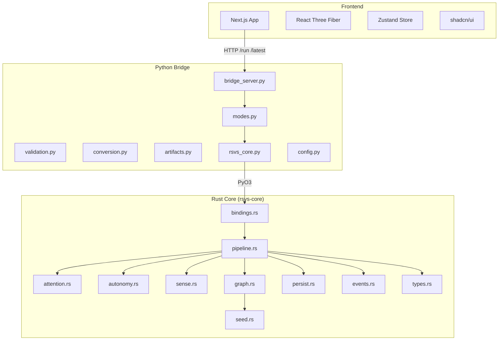
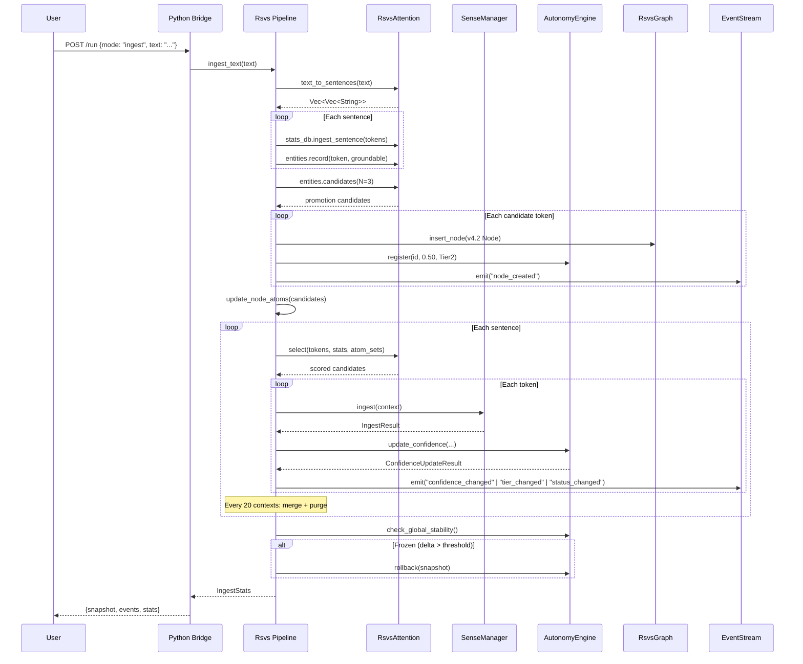
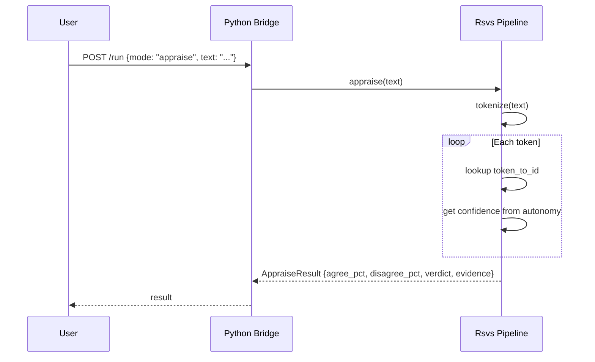
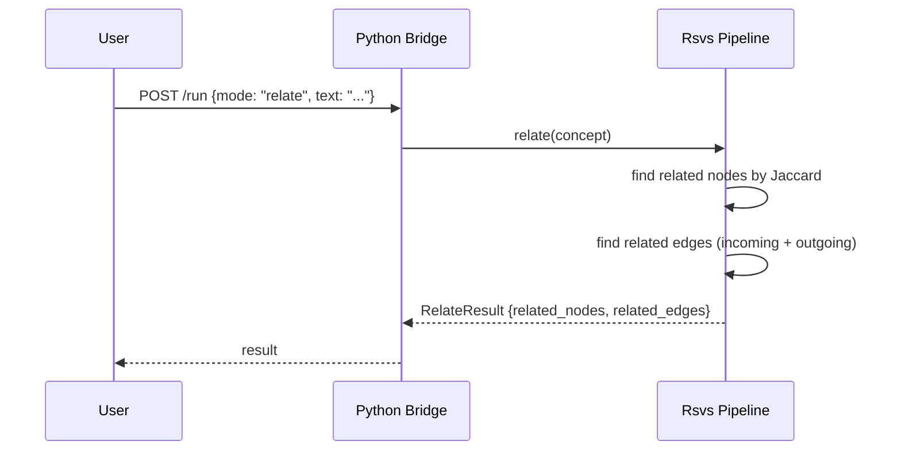
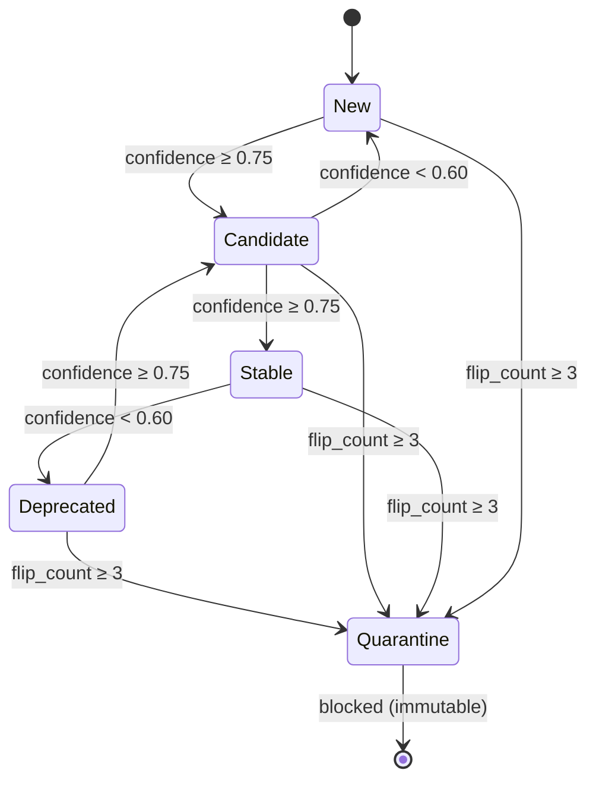
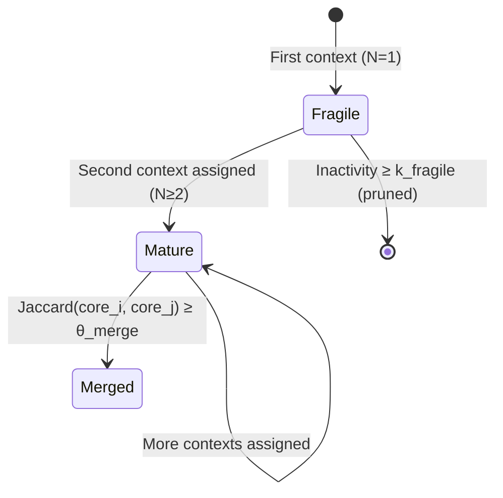
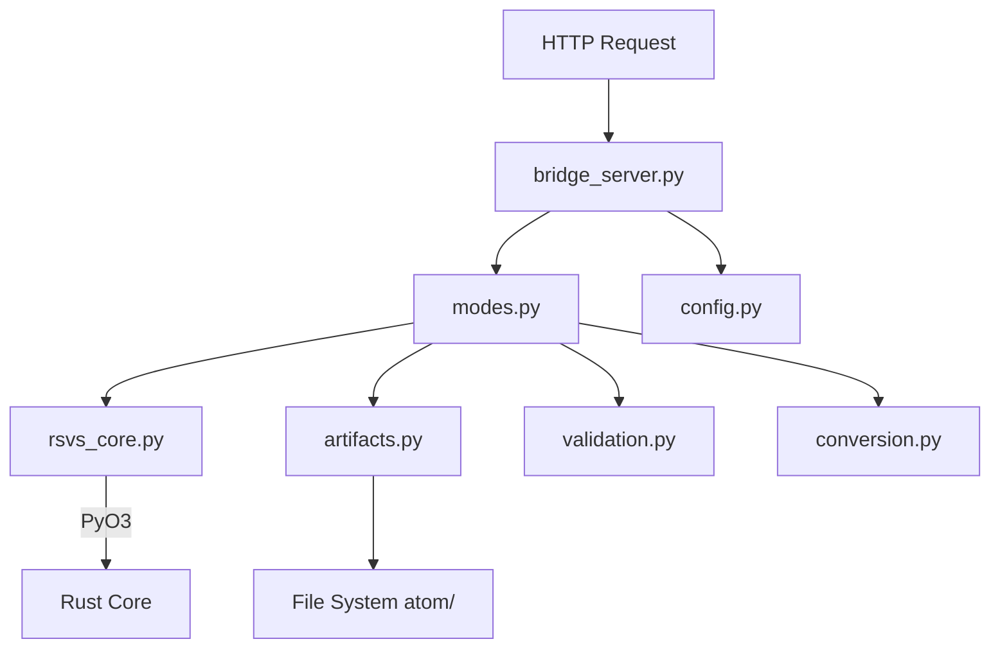
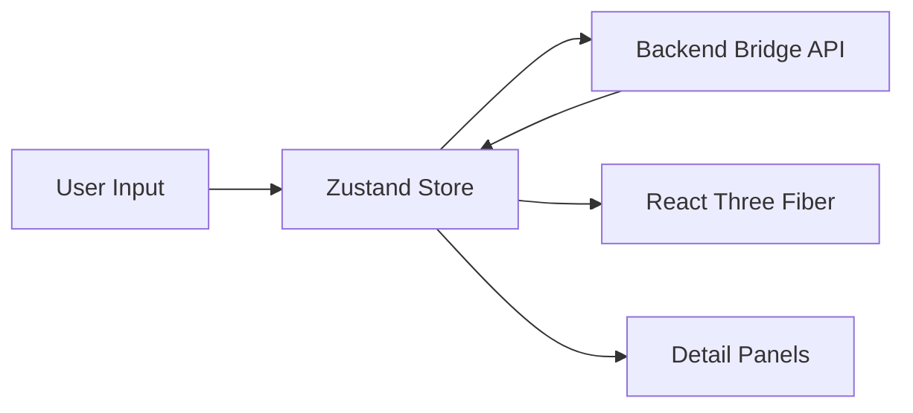

# RSVS Architecture

> Comprehensive technical reference for the Relational Symbolic Vocabulary System (Schema v4.2)

## Table of Contents

1. [System Overview](#1-system-overview)
2. [Core Modules](#2-core-modules)
3. [Data Flow](#3-data-flow)
4. [v4.2 Node Model](#4-v42-node-model)
5. [Attention Mechanism](#5-attention-mechanism)
6. [Autonomy Engine](#6-autonomy-engine)
7. [Multi-Sense Framework](#7-multi-sense-framework)
8. [Policy Engine](#8-policy-engine)
9. [Persistence Layer](#9-persistence-layer)
10. [Python Bridge](#10-python-bridge)
11. [Frontend Architecture](#11-frontend-architecture)
12. [API Contracts](#12-api-contracts)
13. [Schema Validation Rules](#13-schema-validation-rules)
14. [Design Decisions](#14-design-decisions)

---

## 1. System Overview

RSVS is a three-tier system: a **Rust core** for computation, a **Python bridge** for HTTP/API, and a **Next.js frontend** for visualization.



### Tier Responsibilities

| Tier | Language | Responsibility |
|------|----------|----------------|
| Rust Core | Rust 1.75+ | All computational logic: graph, attention, autonomy, sense, persistence |
| Python Bridge | Python 3.10+ | HTTP layer, schema validation, artifact I/O, mode dispatch |
| Frontend | TypeScript | 3D visualization, user interaction, state management |

---

## 2. Core Modules

### Module Dependency Graph

```mermaid
graph LR
    types --> graph
    types --> seed
    types --> attention
    types --> sense
    types --> autonomy
    types --> pipeline
    types --> persist
    types --> events

    graph --> attention
    graph --> sense
    graph --> pipeline

    seed --> pipeline
    attention --> pipeline
    sense --> pipeline
    autonomy --> pipeline
    persist --> pipeline
    events --> pipeline

    pipeline --> bindings
```

### Module Descriptions

| Module | File | Purpose |
|--------|------|---------|
| `types` | `types.rs` | Unified node model, enums, core data structures |
| `graph` | `graph.rs` | DAG storage, Jaccard similarity, edge lookup |
| `seed` | `seed.rs` | Deterministic 24-atom bootstrap |
| `attention` | `attention.rs` | Tokenizer, co-occurrence stats, hard attention scoring |
| `sense` | `sense.rs` | Sense clustering, coherence lifecycle, merge |
| `autonomy` | `autonomy.rs` | Confidence/tier governance, hysteresis, quarantine |
| `pipeline` | `pipeline.rs` | End-to-end orchestration (`Rsvs` struct) |
| `persist` | `persist.rs` | JSON snapshot serialization/deserialization |
| `events` | `events.rs` | Runtime event stream contracts |
| `bindings` | `bindings.rs` | PyO3 Python bindings (`#[cfg(feature = "python")]`) |

---

## 3. Data Flow

### Ingest Pipeline



### Appraise Pipeline



### Relate Pipeline



---

## 4. v4.2 Node Model

### Unified Node Structure

In v4.2, there is no Atom/Composite distinction. All entities are **nodes** with `kind: "node"`. Compression is expressed as metadata.

```rust
struct Node {
    id: NodeId,              // u32
    label: String,           // e.g. "water"
    surface_label: String,   // e.g. "water@en"
    kind: String,            // Always "node" in v4.2
    tier: Tier,              // Tier1 | Tier2 | Tier3
    confidence: f32,         // 0.0..1.0
    status: NodeStatus,      // New | Candidate | Stable | Deprecated | Quarantine
    is_seed: bool,           // Immutable for seed nodes
    is_locked: bool,         // Prevents deletion
    semantic: SemanticMeta,  // Compression metadata
    policy_meta: Option<PolicyMeta>,
    language_links: Vec<LanguageLink>,
    atoms: AtomSet,          // Vec<NodeId> — for similarity/attention
    fingerprint: Option<Fingerprint>,  // Reserved
}
```

### SemanticMeta (v4.2)

```rust
struct SemanticMeta {
    compression_state: CompressionState,  // Raw | Compressed
    derived_from_node_ids: Vec<NodeId>,   // Provenance
    compression_reason: Option<String>,   // Why it was compressed
}
```

### PolicyMeta (v4.2)

```rust
struct PolicyMeta {
    policy_version: String,           // "4.2"
    governance_score: f32,            // 0.0..1.0
    candidate_evidence_pool: f32,     // Accumulated evidence
    status_flip_count: u32,           // Times status changed
    seen_fingerprints: Vec<String>,   // Dedup tracking
    last_seen_at: Option<String>,     // ISO timestamp
}
```

### Compression Invariants

If `compression_state == Compressed`:
- `derived_from_node_ids` **must** be non-empty
- No self-references allowed
- No duplicate IDs
- All referenced IDs must exist in the same snapshot
- `compression_reason` **must** be non-empty

### Edge Model

```rust
struct Edge {
    from: NodeId,
    to: NodeId,
    weight: f32,
    source: EdgeSource,  // Bootstrap | Learned
}
```

---

## 5. Attention Mechanism

### Hard Attention Formula

```
score(t, c) = α · NPMI(t, c) + β · Jaccard(A(t), A(c)) + γ · cooc(t, c)
```

Where:
- **NPMI** = Normalized Pointwise Mutual Information ∈ [-1, 1]
- **Jaccard** = |A(t) ∩ A(c)| / |A(t) ∪ A(c)| ∈ [0, 1]
- **cooc** = count(t, c) / count(t) ∈ [0, 1]

### Default Weights

| Parameter | Default | Role |
|-----------|---------|------|
| α (alpha) | 0.4 | NPMI weight |
| β (beta) | 0.4 | Jaccard weight |
| γ (gamma) | 0.2 | Co-occurrence weight |
| top_k | 10 | Candidates per token |
| min_score | 0.05 | Minimum score threshold |
| min_cooc | 2 | Minimum co-occurrence count |

### NPMI Calculation

```
PMI(t, c) = log(P(t,c) / (P(t) · P(c)))
NPMI(t, c) = PMI(t, c) / (-log(P(t, c)))
```

- P(t) = count(t) / total_tokens
- P(t, c) = count(t, c) / total_sentences
- NPMI ∈ [-1, 1] (clamped)

### Text Processing Pipeline

1. `split_sentences(text)` — Split on `.!?`
2. `tokenize(sentence)` — Lowercase, filter (< 3 chars, digits, stopwords)
3. `CoocStats::ingest_sentence(tokens)` — Update unigram + bigram counts
4. `RsvsAttention::select(tokens, stats, atom_sets)` — Score + TopK

### Entity Detection

Tokens are promoted to nodes when:
1. Appear in ≥ N distinct sentences (default: 3)
2. Are groundable to at least one seed atom (substring match)

### Configuration Override

Set `RSVS_ATTENTION_CONFIG` env var to a JSON file path to override default config.

---

## 6. Autonomy Engine

### Node Lifecycle State Machine



### Confidence Update (EMA)

```
evidence = freq · coherence   (clamped to [0, 1])
proposed = (1 - η) · old + η · evidence
```

Where η (eta) = 0.10 by default.

Constraints:
- **Seed nodes**: confidence updates are skipped (immutable)
- **Energy constraint**: max single-step drop is `max_drop_tolerance` (0.20)
- **Global stability**: if total batch delta > `threshold_global_delta` (5.0), **rollback** entire batch

### Tier Classification

| Condition | Tier |
|-----------|------|
| confidence ≥ 0.85 | Tier1 (Autonomous) |
| confidence ≥ 0.50 AND observations ≥ 3 | Tier2 (Flagged) |
| Otherwise | Tier3 (Blocked) |

### Hysteresis

Promote at ≥ 0.75, demote at < 0.60. The gap (0.15) prevents flip-flopping.

### Quarantine

After 3 status flips (`status_flip_count ≥ quarantine_flip_threshold`), the node is quarantined. Quarantined nodes are blocked from further transitions.

### Governance Score

```
governance_score = 0.4·strength + 0.3·trust + 0.2·recency + 0.1·(1 - contradiction_penalty)
```

### Memory Classes

| Class | Condition |
|-------|-----------|
| Stable | Tier1 AND confidence ≥ 0.99 |
| Working | All other nodes |

### Adaptive Thresholds

```
θ_assign = mean(history) + k1 · std(history)
θ_merge = mean(history) + k2 · std(history)
```

History is capped at 512 observations. Falls back to `fallback_theta_assign` (0.12) or `fallback_theta_merge` (0.50) during warmup.

---

## 7. Multi-Sense Framework

### Sense Lifecycle State Machine



### Sense Ingest Algorithm

1. **Increment inactivity** for all existing senses
2. **If no senses**: create first sense (Fragile)
3. **Candidate pruning**: only score senses with enough core overlap
   - Threshold: `m = ceil(ln(|senses| + 1))` atoms from context must be in `core(τ)`
   - Fragile senses use `τ_core` (0.40), mature senses use `τ_high` (0.65)
4. **Score assignment**: `score = w_sim · Jaccard(context, core) + w_coh · coherence_gain`
5. **Decision**:
   - If `best_score ≥ θ_assign` (0.30): assign to existing sense → Mature if N≥2
   - Otherwise: create new Fragile sense

### Incremental Coherence

Coherence is updated in O(n) per new context (not O(n²) full recompute):

```
new_sum_sim = sum_sim + Σ Jaccard(new_context, existing_context_i)
new_pairs = pair_count + |existing_contexts|
coherence = new_sum_sim / new_pairs
```

Prior for N=1: coherence = 0.5

### Merge

Two mature senses merge when `Jaccard(core_i, core_j) ≥ θ_merge` and both have ≥ `n_min_mature` (5) contexts.

Merge operation:
1. Pool coherence state (sum_sim, pair_count + cross-similarity)
2. Merge frequency maps
3. Merge context lists
4. Remove the lower-indexed sense

### Fragile Pruning

Fragile senses (N=1) with `inactivity ≥ k_fragile` (30) are deleted during periodic maintenance.

---

## 8. Policy Engine

### Core Principle

The policy engine is the **single owner** of governance fields: `tier`, `confidence`, `status`, `is_seed`, `is_locked`.

Ingest/parser provides **candidate evidence only** — it never directly modifies governance fields.

### Governance Invariants

1. **Seed immutability**: seed nodes cannot have confidence, tier, or status changed
2. **Deterministic**: same inputs always produce same outputs
3. **Auditable**: every status change increments `status_flip_count` and emits events
4. **Invariant-safe**: transitions are validated; invalid transitions are blocked

### Evidence Scoring

```
governance_score = 0.4 · strength + 0.3 · trust + 0.2 · recency + 0.1 · (1 - contradiction_penalty)
```

| Component | Meaning |
|-----------|---------|
| Strength | Frequency of observation |
| Trust | Source reliability weight |
| Recency | How recently the node was observed |
| Contradiction penalty | Conflicting evidence penalty |

### Dedup Gate

The `seen_fingerprints` field in `PolicyMeta` tracks observation fingerprints to prevent duplicate evidence from inflating confidence.

---

## 9. Persistence Layer

### Format

JSON (human-readable, debuggable). All snapshots carry `schema_version: "v4.2"`.

### Hard Break Policy

Old schema payloads are **rejected**, not fallback-parsed. There is no backward compatibility with pre-v4.2 `composite` models.

### Snapshot Structure

```json
{
  "version": "4.2",
  "total_contexts": 42,
  "token_to_id": {"water": 25, "stone": 26},
  "next_node_id": 50,
  "nodes": [...],
  "edges": [...],
  "sense_managers": {"25": {"senses": [...], "next_sense_id": 2}},
  "atom_records": [...],
  "cooc_stats": {"token_count": {...}, "pair_count": {"a|b": 5}},
  "entity_detector": {"sentence_count": {...}, "groundable": {...}},
  "entity_promote_n": 3,
  "theta_assign": 0.30,
  "n_warm": 20,
  "eta": 0.10,
  "current_domain": 1
}
```

### Boundary Rules

- `persist.rs` is the **only owner** for JSON snapshot schema and roundtrip behavior
- Runtime modules do not perform direct file I/O; they expose state for `persist.rs`
- Bridge artifacts must carry `schema_version` explicitly
- Python CLI and corpus/eval tooling must not bypass the adapter with custom Rust FFI logic

---

## 10. Python Bridge

### Architecture



### Module Responsibilities

| Module | Responsibility |
|--------|---------------|
| `bridge_server.py` | HTTP handler (`GET /health`, `GET /latest`, `GET /status`, `POST /run`, `POST /ingest`) |
| `config.py` | Configuration constants, API/Schema versions, ISO timestamps |
| `modes.py` | Mode dispatch (`ingest`, `appraise`, `relate`) |
| `validation.py` | Schema validation, view normalization |
| `conversion.py` | Format conversion between internal and API formats |
| `artifacts.py` | File persistence (snapshot, events, reports) |
| `rsvs_core.py` | Rust core wrapper, singleton management, state save/load |
| `exceptions.py` | Exception hierarchy with HTTP status mapping |

### Error Mapping

| Exception | HTTP Status |
|-----------|-------------|
| `SchemaVersionMismatchError` | 409 |
| `SchemaValidationError` | 422 |
| `InvalidModeError` | 400 |
| `RustCoreUnavailableError` | 503 |

---

## 11. Frontend Architecture

### Stack

- **Framework**: Next.js 16 with App Router
- **3D Rendering**: React Three Fiber
- **State Management**: Zustand (`rsvsStore.ts`)
- **UI Components**: shadcn/ui
- **Styling**: Tailwind CSS

### Key Components

| Component | Purpose |
|-----------|---------|
| `GraphScene3D.tsx` | 3D graph scene container |
| `ForceGraph.tsx` | Force-directed layout |
| `GraphNode.tsx` | Individual node rendering |
| `GraphEdge.tsx` | Edge rendering |
| `LeftInputRail.tsx` | Text input + mode selection |
| `RightNodeDrawer.tsx` | Node detail panel |
| `AppraisePanel.tsx` | Appraise mode results |
| `RelatePanel.tsx` | Relate mode results |
| `TimelineBar.tsx` | Event timeline |
| `GraphHUD.tsx` | Heads-up display overlay |

### Data Flow



### Backend Communication

The frontend communicates with the Python bridge via HTTP:
- `GET /health` — Health check
- `POST /run` — Execute a mode (ingest/appraise/relate)
- `GET /latest?mode=...` — Retrieve latest artifacts

---

## 12. API Contracts

### POST /run

**Request:**
```json
{
  "mode": "ingest",
  "text": "Water flows through porous stone",
  "correlation_id": "corr_abc123",
  "schema_version": "v4.2",
  "options": {}
}
```

**Response (ingest):**
```json
{
  "ok": true,
  "correlation_id": "corr_abc123",
  "result": {
    "snapshot": { "nodes": [...], "edges": [...] },
    "events": [...],
    "stats": { "sentences_processed": 3, "atoms_promoted": 2 }
  },
  "messages": [],
  "files": { "snapshot": "atom/snapshot-*.json" }
}
```

**Response (appraise):**
```json
{
  "ok": true,
  "result": {
    "agree_pct": 75.0,
    "disagree_pct": 25.0,
    "verdict": "partial",
    "evidence": [["water", 0.85], ["stone", 0.72]]
  }
}
```

**Response (relate):**
```json
{
  "ok": true,
  "result": {
    "related_nodes": [[5, 0.42], [8, 0.31]],
    "related_edges": [[5, 8, 0.35]]
  }
}
```

### GET /latest?mode=ingest

Returns the latest artifact for the specified mode.

**Query Parameters:**
| Parameter | Default | Values |
|-----------|---------|--------|
| `mode` | `ingest` | `ingest`, `appraise`, `relate` |
| `view` | `compact` | `compact`, `detail` |

### GET /health

```json
{
  "status": "ok",
  "rust_core_available": true,
  "service": "rsvs-bridge",
  "timestamp": "2024-01-15T12:00:00Z",
  "atom_dir": "/path/to/atom",
  "version": "v1",
  "schema_version": "v4.2"
}
```

### GET /status

```json
{
  "ok": true,
  "status": {
    "total_nodes": 30,
    "total_atoms": 28,
    "total_contexts": 42,
    "warmed_up": true,
    "watchlist_count": 0,
    "theta_assign": 0.25,
    "theta_merge": 0.55
  },
  "backend": "rust"
}
```

---

## 13. Schema Validation Rules

### Node Validation

| Field | Rule |
|-------|------|
| `kind` | Must be `"node"` |
| `tier` | Must be 1, 2, or 3 |
| `confidence` | Must be in [0.0, 1.0] |
| `status` | Must be one of: `new`, `candidate`, `stable`, `deprecated`, `quarantine` |
| `compression_state` | Must be `"raw"` or `"compressed"` |
| `surface_label` | Should match `label@lang` format |

### Compression Validation

If `compression_state == "compressed"`:
- `derived_from_node_ids` must be non-empty
- No self-references
- No duplicate IDs
- All referenced IDs must exist in the snapshot
- `compression_reason` must be non-empty

### Edge Validation

| Field | Rule |
|-------|------|
| `from` | Must reference an existing node |
| `to` | Must reference an existing node |
| `weight` | Must be in [0.0, 1.0] |
| `source` | Must be `"bootstrap"` or `"learned"` |

### View Modes

| View | Description |
|------|-------------|
| `compact` | Canonical node output (default) |
| `detail` | Includes expansion/provenance from derived nodes |

---

## 14. Design Decisions

### Why Hard Attention Instead of Softmax?

| Property | Softmax | Hard Attention (RSVS) |
|----------|---------|----------------------|
| Sparsity | Dense (all tokens get weight) | Sparse (only top-k survive) |
| Interpretability | Opaque weights | Explicit NPMI/Jaccard/Cooc decomposition |
| Determinism | Non-deterministic with temperature | Fully deterministic |
| Biological plausibility | Soft allocation | Winner-take-all (closer to neural selection) |

### Why 24 Seed Atoms?

The 24 atoms span 5 layers (existential, spatiotemporal, cognitive, agentic, linguistic) providing a minimal but complete axiomatic foundation. They are:
- **Immutable**: confidence=1.0, never decay, cannot be deleted
- **Groundable**: new tokens must be groundable to at least one seed for promotion
- **Sufficient**: real-world concepts emerge as learned nodes above this layer

### Why EMA for Confidence?

Exponential Moving Average provides:
- **Smooth updates**: no sudden jumps
- **Recency bias**: newer evidence weighted more
- **Bounded**: always in [0, 1]
- **Energy constraint**: max drop tolerance prevents catastrophic forgetting

### Why Hysteresis?

The gap between promote (0.75) and demote (0.60) thresholds prevents:
- **Flip-flopping**: nodes bouncing between statuses
- **Oscillation**: rapid state changes from noisy evidence
- **Wasted computation**: unnecessary event emissions

When flip-flopping does occur (3+ flips), the node is **quarantined** — a circuit-breaker pattern.

### Why Separate Rust Core and Python Bridge?

| Concern | Rust | Python |
|---------|------|--------|
| Graph operations | ✅ Zero-cost abstractions | — |
| Attention scoring | ✅ Tight loops, SIMD-friendly | — |
| HTTP server | — | ✅ stdlib, easy deployment |
| Artifact I/O | — | ✅ File system, JSON |
| PyO3 bindings | ✅ Safe FFI | ✅ Seamless integration |

The boundary ensures: computation is fast, HTTP is simple, and the two can evolve independently.

### Why Unified Node Model (v4.2)?

Previous versions had `Atom` and `Composite` as distinct types. v4.2 unifies them into a single `Node` model where:
- Compression is expressed as **metadata** (`SemanticMeta.compression_state`)
- Provenance is tracked (`derived_from_node_ids`)
- Reasoning is documented (`compression_reason`)

This eliminates type-checking overhead and simplifies all algorithms that previously needed to branch on node kind.
