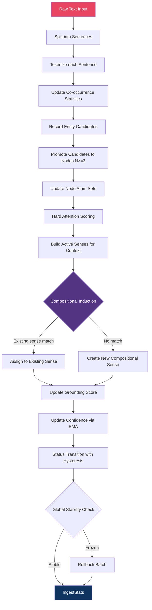
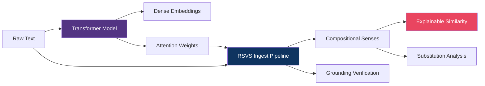
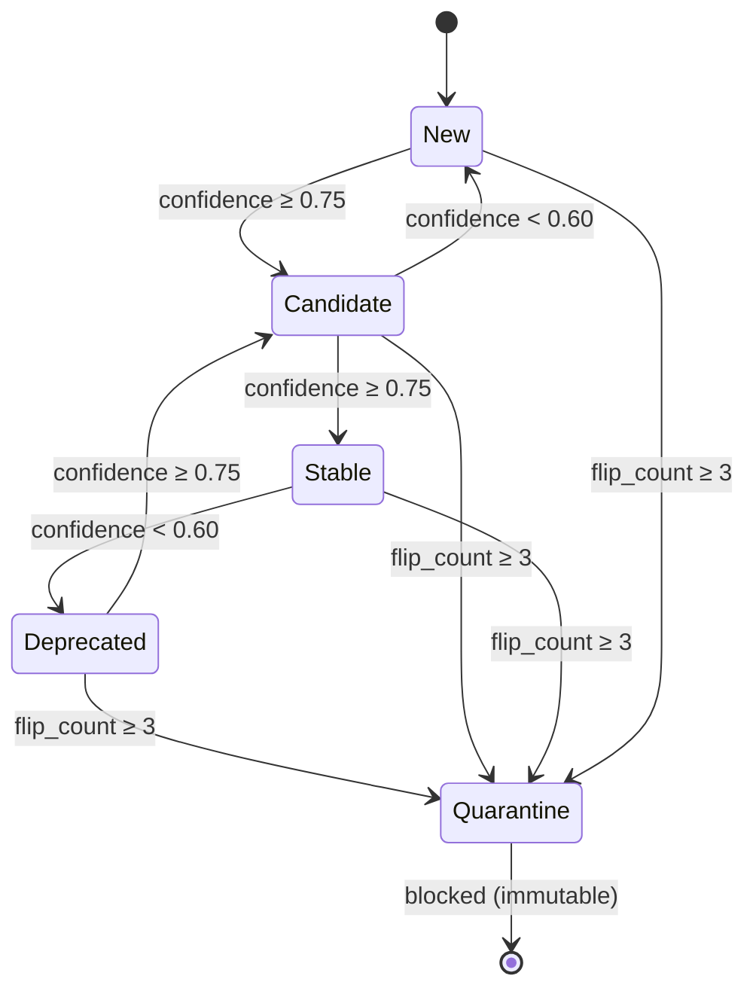
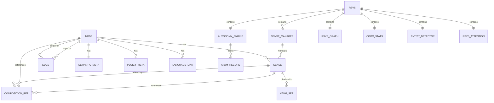
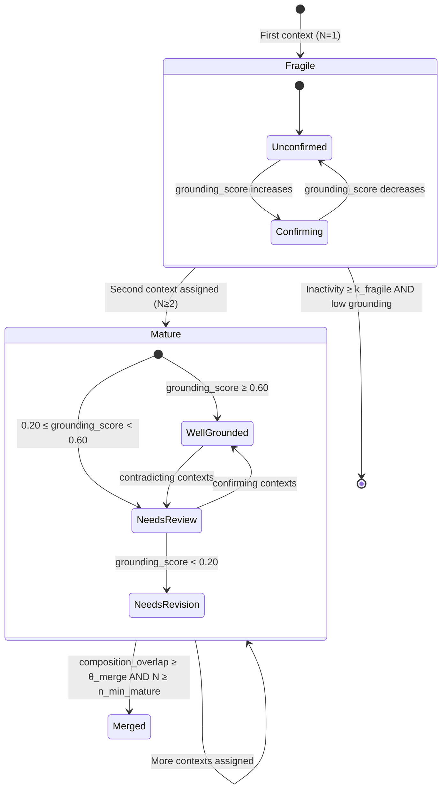

# RSVS Architecture — Compositional Symbolic Meaning

> Technical reference for the Relational Symbolic Vocabulary System, v6.0 Compositional Architecture

---

## Table of Contents

1. [Overview](#1-overview)
2. [Core Concepts](#2-core-concepts)
3. [The Compositional Principle](#3-the-compositional-principle)
4. [Layer Architecture](#4-layer-architecture)
5. [Ingest Pipeline](#5-ingest-pipeline)
6. [Problem 1: Induction](#6-problem-1-induction)
7. [Problem 2: Grounding](#7-problem-2-grounding)
8. [Transformer Bridge](#8-transformer-bridge)
9. [Structural Similarity](#9-structural-similarity)
10. [Autonomy Engine](#10-autonomy-engine)
11. [Data Model](#11-data-model)
12. [API Reference](#12-api-reference)
13. [Performance Characteristics](#13-performance-characteristics)
14. [Scalability & Architecture Considerations](#14-scalability--architecture-considerations)

---

## 1. Overview

### What RSVS Is

The Relational Symbolic Vocabulary System (RSVS) is a compositional symbolic meaning engine. Its fundamental thesis is that **meaning is compositional, not statistical**. When we say that "raja" (king) and "ratu" (queen) are related, RSVS doesn't express this as a cosine similarity between two opaque vectors — it says they share two out of three compositions (tahta_tertinggi, kerajaan) and differ in exactly one (laki_laki vs. perempuan). Every dimension of meaning can be traced back to its constituent senses, and every relationship between concepts can be explained as shared or differing compositions.

RSVS builds a structured knowledge graph where each node (an ID representing a word or entity) can have multiple senses, and each sense is defined by its compositions — pairs of (ID, sense_id) that collectively form the meaning of that sense. This recursive structure means that meaning in RSVS is never atomic beyond the seed layer; it is always a composition of other meanings already in the system. The graph is constructed incrementally from raw text through an ingest pipeline that detects entities, scores attention, induces senses with compositions, verifies grounding, and manages node lifecycles autonomously.

### What RSVS Is Not

RSVS is **not a replacement for Transformer architecture**. It is an interpretation layer on top of it. Transformers produce dense vector representations — powerful but opaque. RSVS transforms those abstract numbers into symbolically referenceable representations where every dimension of meaning can be traced back to its constituent senses. You can use RSVS alongside any Transformer model: the Transformer handles pattern recognition at scale, and RSVS provides the symbolic traceability layer that makes the results interpretable, auditable, and compositional.

RSVS is also not a traditional knowledge graph with hand-curated ontologies. All meaning in RSVS emerges from data through the ingest pipeline. The only human-specified components are the 24 epistemological seed atoms that form the axiomatic foundation of the system. Everything above Layer 0 is learned.

### Key Insight

The key insight of RSVS can be stated in one sentence: **Every sense is formed by other senses.** This principle has profound consequences. It means that similarity between concepts is structural — you can point to exactly which compositions they share and which they differ on. It means that substitution analysis is possible — you can identify the precise swap that transforms one concept into another. And it means that meaning is fully traceable — you can follow the chain of compositions from any high-level concept all the way down to the primitive seed atoms.

---

## 2. Core Concepts

### ID (Identifier)

An ID represents a word or entity in the system. Internally, it is a `u32` integer (`NodeId`) for compact storage and fast lookup. Each ID has a canonical label (e.g., "raja") and a surface form with language tag (e.g., "raja@id"). IDs are the vertices of the knowledge graph — they are what edges connect and what senses belong to.

```rust
pub type NodeId = u32;
```

### Sense

A sense is one meaning of an ID. One ID can have multiple senses depending on context. For example, the ID "bank" might have Sense 0 (financial institution) and Sense 1 (river edge). Senses are not standalone entities — each sense is formed by a set of compositions that define what it means. The `SenseManager` for each node tracks all of its senses, manages their lifecycle (Fragile → Mature → Merged), and handles the assignment of new contexts to existing senses.

```rust
pub struct Sense {
    pub id: SenseId,                          // Index within the parent node
    pub compositions: Vec<CompositionRef>,    // The structural definition
    pub layer: u32,                           // Compositional depth
    pub contexts: Vec<AtomSet>,               // Observational evidence
    pub coherence: f32,                       // Internal consistency
    pub grounding_score: f32,                 // Verification against evidence
    // ...
}
```

### CompositionRef

A `CompositionRef` is the fundamental unit of compositional meaning. It is a pair of `(NodeId, SenseId)` — a reference to a specific sense of a specific node. When sense S of node X is composed from `[(A, s1), (B, s2), (C, s3)]`, it means: "X in sense S means what A means in sense s1, AND what B means in sense s2, AND what C means in sense s3."

```rust
pub struct CompositionRef {
    pub node_id: NodeId,    // The target node
    pub sense_id: SenseId,  // The target sense within that node
}
```

Example: The compositions of "raja" sense 0 are `[(tahta_tertinggi, 0), (laki_laki, 0), (kerajaan, 0)]`. The compositions of "ratu" sense 0 are `[(tahta_tertinggi, 0), (perempuan, 0), (kerajaan, 0)]`.

### Layer

Layer tracks compositional depth. Layer 0 nodes are primitives (seeds or first-order entities). Layer N nodes have at least one composition that references a Layer N-1 sense. Layers form a natural hierarchy:

| Layer | Contents | Example |
|-------|----------|---------|
| 0 | Seed atoms, primitive entities | exists, entity, laki_laki |
| 1 | First-order compositions from text | tahta_tertinggi (highest throne) |
| 2+ | Higher-order recursive compositions | raja (composed from Layer 1 senses) |

```rust
pub fn compute_layer(&self, composition_ids: &[NodeId]) -> u32 {
    if composition_ids.is_empty() { return 0; }
    let max_layer = composition_ids.iter()
        .filter_map(|&id| self.graph.get_node(id))
        .map(|n| n.semantic.layer)
        .max()
        .unwrap_or(0);
    max_layer + 1
}
```

---

## 3. The Compositional Principle

### Every Sense Is Formed by Other Senses

The foundational principle of RSVS v6.0 is that no sense stands alone. Every sense of an ID is formed by other senses already in the system, recursively. This is not a statistical claim (e.g., "these words co-occur") but a structural one: the meaning of a sense is literally the conjunction of the meanings of its composition targets. If you remove a composition, the meaning changes in a precise, traceable way.

### The raja/ratu Example

Consider the Bahasa Indonesia words "raja" (king) and "ratu" (queen). In RSVS:

```
raja.sense_0.compositions = [
    (tahta_tertinggi, 0),   // highest throne
    (laki_laki, 0),         // male
    (kerajaan, 0)           // kingdom
]

ratu.sense_0.compositions = [
    (tahta_tertinggi, 0),   // highest throne
    (perempuan, 0),         // female
    (kerajaan, 0)           // kingdom
]
```

These two concepts share 2 out of 3 compositions, giving a structural similarity score of 2/3 ≈ 0.667. The substitution analysis reveals that replacing `(laki_laki, 0)` with `(perempuan, 0)` transforms raja into ratu. This is not a statistical coincidence — it is the precise structural reason why these words are related.

### Substitution Analysis

Substitution analysis is the operation that identifies exactly which compositions need to change to transform one concept into another. It goes beyond saying "these concepts are similar" — it says *why* they are similar and *what differs*. The `composition_diff` method returns `(only_in_self, only_in_other)`, and substitution analysis pairs these differing compositions to produce a list of precise substitutions.

```rust
pub fn composition_diff(&self, other: &Sense)
    -> (Vec<CompositionRef>, Vec<CompositionRef>)
```

For raja and ratu:
- `only_in_self` = `[(laki_laki, 0)]`
- `only_in_other` = `[(perempuan, 0)]`
- Substitution: `(laki_laki, 0)` → `(perempuan, 0)`

### Why This Matters

Traditional embeddings tell you that raja and ratu have cosine similarity 0.87. RSVS tells you they share tahta_tertinggi and kerajaan, differ in laki_laki vs. perempuan, and that this single substitution accounts for their entire semantic difference. This level of precision enables:

1. **Explainable AI**: Every relationship has a clear, auditable reason
2. **Controlled generation**: Swapping compositions produces semantically coherent variants
3. **Error detection**: If a composition is incorrect, grounding verification will flag it
4. **Cross-lingual reasoning**: The same structural patterns hold across languages

---

## 4. Layer Architecture

```mermaid
graph TB
    subgraph Layer0["Layer 0 — Primitives / Seeds"]
        S1[exists]
        S2[entity]
        S3[relation]
        S4[state]
        S5[change]
        S6[time]
        S7[space]
        S8[cause]
        S9[effect]
        S10[context]
        S11[signal]
        S12[pattern]
        S13[memory]
        S14[attention]
        S15[value]
        S16[agent]
        S17[goal]
        S18[risk]
        S19[trust]
        S20[identity]
        S21[language]
        S22[meaning]
        S23[action]
        S24[feedback]
    end

    subgraph Layer1["Layer 1 — First-order Compositions"]
        L1A[laki_laki]
        L1B[perempuan]
        L1C[tahta_tertinggi]
        L1D[kerajaan]
    end

    subgraph Layer2["Layer 2 — Higher-order Compositions"]
        L2A[raja]
        L2B[ratu]
    end

    L1A --> S1
    L1A --> S2
    L1B --> S1
    L1B --> S2
    L1C --> S2
    L1C --> S16
    L1D --> S2
    L1D --> S16

    L2A --> L1C
    L2A --> L1A
    L2A --> L1D

    L2B --> L1C
    L2B --> L1B
    L2B --> L1D

    style Layer0 fill:#1a1a2e,stroke:#e94560,color:#eee
    style Layer1 fill:#16213e,stroke:#0f3460,color:#eee
    style Layer2 fill:#0f3460,stroke:#533483,color:#eee
```



### Layer 0: Primitives / Seeds

The 24 epistemological seed atoms form the axiomatic foundation of RSVS. These nodes are created at system bootstrapping and are **immutable**: they have confidence = 1.0, Tier = Tier1, status = Stable, and cannot be removed, demoted, or modified. They represent the most fundamental categories of human knowledge — existential, spatiotemporal, cognitive, agentic, and linguistic primitives.

| Category | Seeds |
|----------|-------|
| Existential | `exists`, `entity`, `relation`, `state`, `change` |
| Spatiotemporal | `time`, `space`, `cause`, `effect`, `context` |
| Cognitive | `signal`, `pattern`, `memory`, `attention`, `value` |
| Agentic | `agent`, `goal`, `risk`, `trust`, `identity` |
| Linguistic | `language`, `meaning`, `action`, `feedback` |

All seed nodes have `layer = 0`, `compression_state = Raw`, and empty composition lists. They are the ground truth from which all higher-order meanings are recursively constructed.

### Layer 1: First-Order Compositions

When text is first ingested, the system promotes frequently occurring tokens to nodes. These first-order entities (like "laki_laki", "perempuan", "tahta_tertinggi") start at Layer 0 as raw nodes but can be promoted to Layer 1 when their senses acquire compositions. A Layer 1 node has at least one sense whose compositions reference only Layer 0 nodes.

The transition from Layer 0 to Layer 1 happens during sense induction: when a new sense is created for a node, the system identifies which `(ID, sense_id)` pairs are active in the context and uses them as the compositions. If any of those targets are Layer 0, the new sense is at least Layer 1.

### Layer 2+: Higher-Order Recursive Compositions

Layer 2 and above represent concepts that are composed from other composed concepts. "Raja" is a Layer 2 concept because its compositions reference Layer 1 entities (tahta_tertinggi, laki_laki, kerajaan). This recursive composition can continue indefinitely — Layer 3 concepts reference Layer 2 senses, and so on.

The layer of a new node is computed as `max(layer of all composition targets) + 1`. This ensures that the layer always reflects the maximum depth of compositional recursion. If a node has compositions referencing both Layer 0 and Layer 3 nodes, it is Layer 4.

---

## 5. Ingest Pipeline

The ingest pipeline is the primary mechanism by which raw text is transformed into structured compositional knowledge. It runs as a single atomic operation on the Rust core, producing new nodes, senses, compositions, edges, and confidence updates.

### Pipeline Flow



### Step-by-Step Walkthrough

**Step 1: Tokenize.** Raw text is split into sentences (on `.!?` boundaries) and each sentence is tokenized: lowercase, filter tokens shorter than 3 characters, remove pure digits, remove stopwords. This produces `Vec<Vec<String>>` — a list of sentences, each a list of tokens.

**Step 2: Co-occurrence Statistics.** For each sentence, `CoocStats::ingest_sentence(tokens)` updates unigram counts, bigram pair counts, and total token/sentence counters. These statistics are used later for NPMI computation and attention scoring.

**Step 3: Entity Detection.** Each token is recorded by the `EntityDetector` with a grounding flag (whether the token is groundable to any seed atom via substring match). Tokens that appear in ≥ N sentences (default: 3) AND are groundable are promoted to nodes.

**Step 4: Node Promotion.** For each qualifying entity candidate that doesn't already exist in the graph, a new `Node` is created with `tier = Tier2`, `confidence = 0.50`, `status = Candidate`, `layer = 0`. The node is registered with the autonomy engine and a `SenseManager` is created for it.

**Step 5: Atom Set Update.** For each promoted (and existing) node, co-occurrence statistics are used to build/update the node's atom set — the top-N most strongly co-occurring other nodes. This also updates the node's `compression_state` to `Compressed` and creates/updates `Learned` edges.

**Step 6: Attention Scoring.** For each sentence, the hard-attention mechanism scores all (token, candidate) pairs using the formula `score = α·NPMI + β·Jaccard + γ·cooc` and selects top-k candidates per token. This produces a sparse, deterministic, interpretable attention map.

**Step 7: Active Sense Resolution.** For each token in the sentence, the system determines which sense of each context node is currently active (via `active_sense_for_node`). This produces a list of `(NodeId, SenseId)` pairs — the active senses in the current context.

**Step 8: Sense Induction with Compositions.** For each token that has an ID in the graph, the active senses from Step 7 are used as the compositions of a new (or existing) sense. The `SenseManager::induce_sense` method either assigns the context to an existing sense whose compositions match well enough (composition overlap ≥ θ_assign), or creates a new compositional sense with the induced compositions.

**Step 9: Grounding Update.** After a sense is assigned or created, the grounding score is updated based on whether the context confirms or contradicts the compositions. A confirming context (high overlap with composition node IDs) boosts the grounding score; a contradicting context (low overlap) penalizes it.

**Step 10: Confidence Update.** The autonomy engine updates the node's confidence using EMA: `new_conf = (1 - η) · old_conf + η · (freq × coherence)`. Energy constraints limit single-step drops, and the status lifecycle transitions (New → Candidate → Stable → Deprecated) are attempted with hysteresis.

**Step 11: Global Stability Check.** After all sentences are processed, the total confidence delta across the batch is checked. If it exceeds the threshold, the entire batch is rolled back to the pre-batch snapshot.

---

## 6. Problem 1: Induction

### The Induction Problem

The first fundamental problem of RSVS is: **How are senses formed from text?** Given a stream of raw text, the system must determine when a new sense is worth initiating, how boundaries between senses are drawn from raw text distribution, and which (ID, sense) pairs form the compositions of the new sense.

### Context-Based Sense Boundary Detection

Senses are not predefined — they emerge from the distribution of contexts in which an ID appears. When a token appears in a context that is sufficiently different from all existing senses of that token, a new sense is created. The boundary between senses is determined by the `theta_assign` threshold: if the best-matching existing sense has a score below this threshold, a new sense is created.

For compositional senses, the scoring uses composition overlap (Jaccard over `CompositionRef` sets) rather than raw atom-set overlap. This means that two contexts produce different senses if and only if they induce different compositions — i.e., the active senses of context tokens differ in a meaningful way.

### Entropy Threshold for New Sense Creation

The decision to create a new sense vs. assign to an existing one is governed by a scoring function that balances two factors:

```
score = w_sim · composition_overlap + w_coh · coherence_gain
```

Where:
- `w_sim = 0.6` (weight for similarity term)
- `w_coh = 0.4` (weight for coherence gain term)
- `composition_overlap = |shared_compositions| / |union_compositions|` (Jaccard over CompositionRef sets)
- `coherence_gain = simulated_coherence - current_coherence` (how much adding this context would improve internal consistency)

If `score < theta_assign` (default: 0.30), a new sense is created. This threshold acts as an entropy gate: only contexts that are sufficiently distinct from all existing senses trigger new sense creation. The adaptive threshold mechanism (`mean(history) + k1·std(history)`) auto-tunes this over time based on observed score distributions.

### Composition Divergence Scoring

When comparing a new context against existing senses, the system computes composition divergence — the fraction of compositions that differ between the induced compositions and the sense's existing compositions. A high divergence means the context represents a genuinely different meaning and should form a new sense.

The `composition_overlap` method on `Sense` computes this precisely:

```rust
pub fn composition_overlap(&self, other: &Sense) -> f32 {
    let shared = self.compositions.iter()
        .filter(|c| other.compositions.contains(c))
        .count();
    let union = self.compositions.len() + other.compositions.len() - shared;
    if union == 0 { 0.0 } else { shared as f32 / union as f32 }
}
```

### Maximum Sense Proliferation Control

Without controls, the system could create an unbounded number of senses. RSVS employs multiple mechanisms to prevent sense proliferation:

1. **Candidate pruning**: Before scoring all senses, only senses with sufficient core overlap are considered. The threshold is `m = ceil(ln(|senses| + 1))` — it grows logarithmically with the number of senses, making it harder for each additional sense to be scored.

2. **Merge mechanism**: Mature senses with composition overlap ≥ `theta_merge` (default: 0.50) and minimum context count ≥ `n_min_mature` (default: 5) are automatically merged. Merging pools their coherence state, frequency maps, context lists, and compositions (union).

3. **Fragile pruning**: Senses with only one context (status: Fragile) that have been inactive for ≥ `k_fragile` (default: 30) global contexts AND have low grounding scores are automatically deleted.

4. **Assignment preference**: The system preferentially assigns contexts to existing senses rather than creating new ones. A context only creates a new sense when no existing sense provides a good enough match.

---

## 7. Problem 2: Grounding

### The Grounding Problem

The second fundamental problem of RSVS is: **How to ensure compositions formed are accurate?** After a new sense forms, it is represented as pairs `(ID_a, sense_z)`. The system must verify that the composition truly reflects facts in the source text, not artifacts of the ingest process.

### Confirming vs. Contradicting Evidence

Every time a new context is processed for a node, the system checks whether the context confirms or contradicts the existing compositions. A context "confirms" if it overlaps significantly with the composition node IDs; it "contradicts" if it has little overlap.

```rust
pub fn update_grounding(&mut self, context_node_ids: &[NodeId], config: &SenseConfig) {
    if self.compositions.is_empty() { return; }  // Primitives don't need grounding
    let comp_node_ids: Vec<NodeId> = self.compositions.iter().map(|c| c.node_id).collect();
    let overlap = context_node_ids.iter()
        .filter(|id| comp_node_ids.contains(id))
        .count();
    let overlap_ratio = overlap as f32 / comp_node_ids.len().max(1) as f32;

    if overlap_ratio >= config.theta_comp_overlap {
        self.grounding_score = (self.grounding_score + config.grounding_boost).min(1.0);
    } else {
        self.grounding_score = (self.grounding_score - config.grounding_penalty).max(0.0);
    }
}
```

The key design choice is that `grounding_penalty` (default: 0.10) is **twice** `grounding_boost` (default: 0.05). This ensures that grounding degrades faster than it builds — a sense must be consistently confirmed to maintain high grounding, but only a few contradictions are needed to flag it.

### Grounding Score Decay and Boost

The grounding score follows a bounded random walk:

- **Initial value**: `grounding_initial` = 0.50 (neutral starting point)
- **Boost**: Each confirming context adds `grounding_boost` = 0.05, capped at 1.0
- **Penalty**: Each contradicting context subtracts `grounding_penalty` = 0.10, floored at 0.0
- **Asymmetry**: Penalty > Boost ensures that poor compositions are caught quickly

The asymmetric decay/boost ratio means that a sense needs approximately twice as many confirming contexts as contradicting ones to maintain its grounding level. This is intentional — it is better to flag a questionable composition for review than to let it persist unchallenged.

### Automatic Composition Revision

When a sense's grounding score drops below `grounding_min` (default: 0.20), the sense becomes a candidate for automatic revision. Revision can take several forms:

1. **Composition replacement**: The system can re-induce compositions from recent contexts, replacing the low-grounded compositions with ones that are better supported by evidence.

2. **Sense deletion**: If a Fragile sense (N=1) has low grounding AND high inactivity, it is pruned during periodic maintenance.

3. **Sense merge**: If a low-grounded sense is similar to a higher-grounded sense, merging can absorb the well-grounded compositions.

The `is_grounded` method provides the check:

```rust
pub fn is_grounded(&self, min: f32) -> bool {
    self.compositions.is_empty() || self.grounding_score >= min
}
```

### Grounding Verdicts

The grounding score maps to three verdict categories that guide system behavior:

| Verdict | Grounding Score | Action |
|---------|----------------|--------|
| **WellGrounded** | ≥ 0.60 | Sense is trusted; compositions are used for similarity, substitution, and further induction |
| **NeedsReview** | 0.20 – 0.59 | Sense is functional but flagged; compositions are used with caution; future contexts will determine direction |
| **NeedsRevision** | < 0.20 | Sense is candidate for revision or deletion; compositions should not be used as targets for further induction |

These verdicts are not stored explicitly — they are computed on-the-fly from the grounding score. This avoids the need for an additional state machine and keeps the grounding mechanism purely evidence-driven.

---

## 8. Transformer Bridge

### RSVS as Interpretation Layer

RSVS is explicitly designed as an interpretation layer ON TOP of Transformer architecture, not a replacement for it. The relationship is symbiotic: Transformers excel at pattern recognition at scale (dense attention over millions of tokens), while RSVS excels at producing symbolically traceable representations from the patterns that Transformers discover.

Think of it this way: a Transformer tells you that "raja" and "ratu" have an attention weight of 0.87. RSVS tells you that they share the compositions (tahta_tertinggi, 0) and (kerajaan, 0), differ in (laki_laki, 0) vs. (perempuan, 0), and that substituting one for the other transforms a king into a queen. The Transformer provides the statistical signal; RSVS provides the structural explanation.

### Why RSVS Doesn't Replace Transformers

Transformers solve a fundamentally different problem than RSVS. They process raw text at scale, learning dense representations that capture statistical patterns across billions of tokens. RSVS cannot and should not replicate this — instead, it builds on top of it. Several specific reasons:

1. **Scale**: Transformers handle billions of parameters and tokens efficiently via GPU parallelism. RSVS operates at the symbolic level, where each composition is an explicit reference, not a weight in a matrix.

2. **Generalization**: Transformers generalize to unseen patterns through interpolation in vector space. RSVS generalizes through structural composition — if two concepts share compositions, they are structurally similar regardless of surface form.

3. **Inference speed**: Transformer inference is O(n²) in sequence length for self-attention. RSVS inference (query, similarity, substitution) is O(k) where k is the number of compositions, typically 3-8.

4. **Complementarity**: The best results come from using both. A Transformer can identify that "raja" and "ratu" should be in the same attention cluster; RSVS can explain precisely why they are related.

### How Transformer Attention Weights Map to Sense Compositions

The bridge between Transformers and RSVS operates at the attention layer. In a Transformer, the attention weight `α(i, j)` between tokens i and j indicates how much token i attends to token j. In RSVS, this maps to the hard-attention scoring mechanism:

```
score(t, c) = α · NPMI(t, c) + β · Jaccard(A(t), A(c)) + γ · cooc(t, c)
```

Where the NPMI and co-occurrence terms approximate the information captured by Transformer attention, and the Jaccard term captures the structural overlap that Transformers miss. The mapping is:

| Transformer Concept | RSVS Equivalent |
|---------------------|-----------------|
| Attention weight α(i,j) | `score(t, c)` from hard-attention formula |
| Query/Key/Value vectors | `AtomSet` for each node (compact representation) |
| Multi-head attention | Multiple senses per node (each "head" is a sense) |
| Softmax normalization | Top-K selection (hard attention) |
| Dense weight matrix | Sparse composition references |

### The Symbolic Traceability Advantage

The core advantage of RSVS over raw Transformer vectors is **symbolic traceability**. In a Transformer, if you ask "why does the model think raja and ratu are similar?", the answer is "because their vectors have high cosine similarity" — which is tautological. In RSVS, the answer is "because they share the compositions (tahta_tertinggi, 0) and (kerajaan, 0), and differ only in (laki_laki, 0) vs. (perempuan, 0)." Every dimension of meaning can be traced back to its constituent senses, all the way down to the seed atoms.

This traceability enables:

- **Auditing**: Verify that a relationship is based on accurate compositions
- **Debugging**: Identify which composition is causing an error
- **Editing**: Change a composition to fix a misinterpretation
- **Explainability**: Provide human-readable reasons for every relationship

### Using RSVS Alongside Any Transformer Model

RSVS is model-agnostic. It can be used alongside any Transformer architecture (BERT, GPT, LLaMA, etc.) through the ingest pipeline:

1. **From Transformer embeddings**: Use the Transformer to extract entity relationships from text, then feed the extracted text into RSVS's ingest pipeline. The Transformer does the heavy lifting of language understanding; RSVS adds the symbolic traceability layer.

2. **From attention distributions**: Extract attention weight distributions from a Transformer layer and use them to influence RSVS's attention scoring. The `AttentionConfig` can be tuned to weight NPMI, Jaccard, and co-occurrence differently based on the Transformer's attention patterns.

3. **From token representations**: Use Transformer token embeddings as initial atom sets for RSVS nodes. This gives RSVS a warm start with semantically meaningful initial representations.

4. **Pipeline integration**: Run the Transformer and RSVS in parallel. Use the Transformer for tasks that require dense vector operations (classification, generation), and RSVS for tasks that require symbolic reasoning (similarity explanation, substitution analysis, grounding verification).



---

## 9. Structural Similarity

### How raja and ratu Are Related

Structural similarity in RSVS operates at the sense level, comparing the compositions of two nodes' senses to determine how they are related. This is fundamentally different from statistical similarity (cosine distance between vectors) because it produces an explicit decomposition: shared compositions, compositions only in A, and compositions only in B.

### Shared Compositions

For raja and ratu, the shared compositions are the structural reason they are related:

```
Shared:
  (tahta_tertinggi, 0)  — "highest throne" — the sovereign authority aspect
  (kerajaan, 0)         — "kingdom" — the domain/governance aspect
```

These two compositions capture what raja and ratu have in common: both are sovereign rulers of a kingdom. The shared compositions provide the "why they are similar" part of the analysis.

### Differing Compositions

The differing compositions capture what makes each concept distinct:

```
Only in raja:  (laki_laki, 0)  — "male"
Only in ratu:  (perempuan, 0)  — "female"
```

The differing compositions provide the "why they are different" part of the analysis. In this case, the entire difference between a king and a queen reduces to a single composition swap.

### Substitution Analysis: The Precise Swap

Substitution analysis goes beyond similarity by identifying the exact transformations that convert one concept into another. For raja → ratu:

```
Substitution: (laki_laki, 0) → (perempuan, 0)
Structural similarity: 0.667 (2/3 shared)
Unpaired only_a: []  (no excess compositions in raja)
Unpaired only_b: []  (no excess compositions in ratu)
```

This single substitution is the complete semantic difference between "king" and "queen" in RSVS's representation. The `substitution_analysis` method on `RsvsGraph` computes this by first finding the best-matching sense pair (by structural similarity), then pairing up the differing compositions:

```rust
pub fn substitution_analysis(
    &self, a: NodeId, b: NodeId,
    senses_a: &SenseManager, senses_b: &SenseManager,
) -> Option<SubstitutionResult>
```

The result includes:
- **Substitutions**: Paired (from, to) CompositionRef pairs — the precise swaps
- **Unpaired only_a**: Compositions in A with no counterpart in B
- **Unpaired only_b**: Compositions in B with no counterpart in A
- **Structural similarity**: The overall similarity score

### Structural Similarity Algorithm

The `structural_similarity` method finds the best-matching sense pair across two nodes by iterating over all sense pairs and computing the Jaccard-like overlap of their composition sets:

```
structural_similarity(A_sense_i, B_sense_j) = |shared_compositions| / |union_compositions|
```

The best-scoring pair is returned as the `StructuralSimResult`, which contains:
- `sense_idx_a`, `sense_idx_b`: The indices of the best-matching senses
- `shared_compositions`: Compositions present in both senses
- `only_a_compositions`: Compositions only in sense A
- `only_b_compositions`: Compositions only in sense B
- `structural_similarity`: The score
- `layer_a`, `layer_b`: The compositional depths

---

## 10. Autonomy Engine

### Confidence, Tiers, Lifecycle

The autonomy engine manages the lifecycle of every non-seed node in the system. It tracks confidence scores, tier classifications, and status transitions independently from the sense management system. The core idea is that nodes should autonomously promote and demote themselves based on evidence, with circuit-breaker mechanisms to prevent pathological behavior.

### Confidence Update (EMA)

Confidence follows an exponential moving average:

```
evidence = freq × coherence  (clamped to [0, 1])
proposed = (1 - η) × old + η × evidence
```

Where η (eta) = 0.10 by default. The EMA provides smooth, stable updates that respond to sustained evidence rather than single observations. The `max_drop_tolerance` (0.20) prevents catastrophic single-step confidence drops.

### Tier Classification

| Condition | Tier | Meaning |
|-----------|------|---------|
| confidence ≥ 0.85 | Tier1 | Autonomous — trusted, long-term memory |
| confidence ≥ 0.50 AND observations ≥ 3 | Tier2 | Flagged — revocable, under evaluation |
| Otherwise | Tier3 | Blocked — low confidence, needs decision |

### Lifecycle State Machine



### Hysteresis

The gap between promotion (≥ 0.75) and demotion (< 0.60) thresholds prevents flip-flopping. A node must drop by 0.15 before being demoted, and must rise by the same amount before being promoted back. This 0.15 dead zone ensures that nodes near the boundary don't oscillate rapidly between statuses.

### Quarantine

If a node's status changes 3 or more times (`status_flip_count ≥ quarantine_flip_threshold`), it is quarantined. Quarantined nodes are blocked from further transitions — they represent a circuit-breaker pattern that prevents pathological oscillation from contaminating the rest of the graph.

### Memory Classes

| Class | Condition | Behavior |
|-------|-----------|----------|
| Stable | Tier1 AND confidence ≥ 0.99 | Long-term memory, rarely updated |
| Working | All other nodes | Short-term memory, actively updated |

### Governance Score

```
governance_score = 0.4·strength + 0.3·trust + 0.2·recency + 0.1·(1 - contradiction_penalty)
```

The governance score provides a holistic assessment of node quality that combines frequency of observation (strength), source reliability (trust), temporal relevance (recency), and consistency (contradiction penalty). It is used for policy decisions about node promotion and retention.

---

## 11. Data Model

### Complete Type Definitions

#### Primitive Types

```rust
pub type NodeId = u32;      // 4 bytes — compact node identifier
pub type SenseId = u32;      // 4 bytes — sense index within a node
pub type AtomSet = Vec<NodeId>;  // Set of node IDs for similarity/attention
```

#### CompositionRef — The Fundamental Unit

```rust
pub struct CompositionRef {
    pub node_id: NodeId,    // Target node
    pub sense_id: SenseId,  // Target sense within that node
}
```

#### Node — A Graph Vertex

```rust
pub struct Node {
    pub id: NodeId,
    pub label: String,                    // "raja"
    pub surface_label: String,            // "raja@id"
    pub kind: String,                     // Always "node" in v6.0
    pub tier: Tier,                       // Tier1 | Tier2 | Tier3
    pub confidence: f32,                  // 0.0..1.0
    pub status: NodeStatus,               // New | Candidate | Stable | Deprecated | Quarantine
    pub is_seed: bool,
    pub is_locked: bool,
    pub semantic: SemanticMeta,           // Compositional metadata
    pub policy_meta: Option<PolicyMeta>,
    pub language_links: Vec<LanguageLink>,
    pub atoms: AtomSet,                   // For similarity/attention (backward compat)
    pub fingerprint: Option<Fingerprint>,
}
```

#### SemanticMeta — Compositional Metadata

```rust
pub struct SemanticMeta {
    pub compression_state: CompressionState,  // Raw | Compressed
    pub layer: u32,                           // 0 = primitive, N = composed
    pub derived_from_node_ids: Vec<NodeId>,   // Provenance
    pub compression_reason: Option<String>,   // "compositional induction" | "co-occurrence aggregation"
}
```

#### Sense — A Meaning Cluster

```rust
pub struct Sense {
    pub id: SenseId,
    pub compositions: Vec<CompositionRef>,    // Structural definition
    pub layer: u32,                           // Compositional depth
    pub contexts: Vec<AtomSet>,               // Observational evidence
    pub freq_counts: HashMap<NodeId, usize>,  // Atom frequency map
    pub coherence: f32,                       // Internal consistency
    pub status: SenseStatus,                  // Fragile | Mature
    pub inactivity: usize,                    // Contexts since last assignment
    pub grounding_score: f32,                 // Verification score
}
```

#### Edge — A Directed Weighted Connection

```rust
pub struct Edge {
    pub from: NodeId,
    pub to: NodeId,
    pub weight: f32,              // 0.0..1.0
    pub source: EdgeSource,       // Bootstrap | Learned | Composition
}
```

#### Enumerations

```rust
pub enum NodeStatus { New, Candidate, Stable, Deprecated, Quarantine }
pub enum CompressionState { Raw, Compressed }
pub enum Tier { Tier1, Tier2, Tier3 }
pub enum EdgeSource { Bootstrap, Learned, Composition }
pub enum SenseStatus { Fragile, Mature }
pub enum IngestResult { Assigned(usize), Created(usize) }
```

### Entity-Relationship Diagram



### Sense Lifecycle Diagram



---

## 12. API Reference

### Rust Core API

#### Rsvs::new

```rust
pub fn new(config: PipelineConfig) -> Result<Self, RsvsError>
```

Creates a new RSVS instance and bootstraps the 24 seed atoms. The config parameter controls all tunable knobs for attention, sense management, and autonomy.

#### Rsvs::ingest_text

```rust
pub fn ingest_text(&mut self, text: &str) -> Result<IngestStats, RsvsError>
```

Runs the full ingest pipeline: tokenize → co-occurrence → entity detection → node promotion → attention → sense induction (with compositions) → grounding → confidence update → stability check.

Returns `IngestStats` with counts of sentences processed, atoms promoted, senses created/assigned, compositions induced, and confidence updates.

#### Rsvs::compose

```rust
pub fn compose(&mut self, label: &str, compositions: Vec<CompositionRef>, lang: Option<&str>) -> Result<NodeId, RsvsError>
```

Creates a compositional node from explicit composition references. This is the core compositional mechanism: higher-level concepts are built from specific senses of lower-level concepts.

Example:
```rust
let compositions = vec![
    CompositionRef::new(tahta_id, 0),
    CompositionRef::new(laki_laki_id, 0),
    CompositionRef::new(kerajaan_id, 0),
];
let node_id = rsvs.compose("raja", compositions, Some("id"))?;
```

#### Rsvs::query

```rust
pub fn query(&self, concept: &str, query_context: &str) -> Option<QueryResult>
```

Context-aware lookup for a concept. Returns the active sense (based on context), scored atoms, layer, grounding score, and compositions.

#### Rsvs::structural_similarity

```rust
pub fn structural_similarity(&self, a: &str, b: &str) -> Option<StructuralSimResult>
```

Computes structural similarity between two concepts at the sense level. Returns shared compositions, differing compositions, and similarity score.

#### Rsvs::substitution_analysis

```rust
pub fn substitution_analysis(&self, a: &str, b: &str) -> Option<SubstitutionResult>
```

Analyzes what substitution transforms one concept into another. Returns paired substitutions and unpaired compositions.

#### Rsvs::appraise

```rust
pub fn appraise(&self, text: &str) -> AppraiseResult
```

Evaluates text against the graph. Returns agree/disagree percentages and a verdict ("consistent", "partial", or "novel").

#### Rsvs::relate

```rust
pub fn relate(&self, concept: &str) -> Option<RelateResult>
```

Finds nodes and edges related to a concept. Includes structural relations based on composition overlap (v6.0).

#### Rsvs::save / Rsvs::load

```rust
pub fn save(&self, path: &Path) -> Result<(), RsvsError>
pub fn load(path: &Path) -> Result<Self, RsvsError>
```

Serialize/deserialize the full RSVS state to/from JSON.

### Python API (via PyO3)

#### PyRsvs Initialization

```python
from rsvs import Rsvs

r = Rsvs(entity_promote_n=3, theta_assign=0.12, n_warm=20, eta=0.1)
```

#### Ingest

```python
stats = r.ingest("Raja adalah pemimpin kerajaan. Ratu adalah pemimpin perempuan.")
# IngestStats(sentences=2, atoms_promoted=5, senses_created=5, compositions=15)
```

#### Compose

```python
node_id = r.compose("raja", [
    ("tahta_tertinggi", 0),
    ("laki_laki", 0),
    ("kerajaan", 0)
], "id")
```

#### Structural Similarity

```python
sim = r.structural_similarity("raja", "ratu")
# StructuralSim(score=0.667, shared=2, only_a=1, only_b=1, layers=2/2)
labels = sim.shared_labels(r)  # [("tahta_tertinggi", 0), ("kerajaan", 0)]
```

#### Substitution Analysis

```python
sub = r.substitution_analysis("raja", "ratu")
# SubstitutionResult(sim=0.667, subs=1, unpaired_a=0, unpaired_b=0)
labels = sub.substitution_labels(r)  # [("laki_laki", 0, "perempuan", 0)]
```

#### Query

```python
result = r.query("raja", "pemimpin kerajaan laki-laki")
# QueryResult(sense=0, N=3, layer=2, atoms=[...], comps=3)
```

### HTTP API (FastAPI)

| Endpoint | Method | Description |
|----------|--------|-------------|
| `/run` | POST | General mode dispatch (ingest, query, appraise, relate, compose, structural_similarity, substitution_analysis) |
| `/ingest` | POST | Text ingestion |
| `/query` | POST | Context-aware concept lookup |
| `/similarity` | POST | Flat Jaccard similarity (v4 compat) |
| `/structural-similarity` | GET | Structural similarity with composition breakdown |
| `/substitution-analysis` | GET | Substitution analysis between two concepts |
| `/compose` | POST | Create compositional node |
| `/appraise` | POST | Evaluate text against graph |
| `/relate` | POST | Find related nodes/edges |
| `/node-info` | POST | Enriched node information |
| `/senses` | POST | Sense information with compositions |
| `/snapshot` | GET | Full graph snapshot |
| `/events` | GET | Incremental event stream |
| `/health` | GET | Health check |

---

## 13. Performance Characteristics

### Time Complexity

| Operation | Complexity | Notes |
|-----------|-----------|-------|
| Jaccard similarity | O(\|A\| + \|B\|) | Linear in atom set sizes |
| NPMI lookup | O(1) | HashMap lookup |
| Co-occurrence ingest | O(n²) | n = tokens per sentence (5–20 typical) |
| Sense ingest | O(S × K) | S = senses, K = core size; pruned by `ceil(ln(S+1))` |
| Compositional induction | O(C × S) | C = context size, S = senses with composition match |
| Structural similarity | O(S_a × S_b × C) | S = senses per node, C = max compositions per sense |
| Substitution analysis | O(S_a × S_b × C) | Same as structural similarity + diff |
| Full pipeline ingest | O(T × S × K) | T = tokens, S = senses, K = core atoms |
| Relate (Jaccard) | O(N × \|A\|) | N = total nodes, parallelized via rayon |

### Memory Usage

| Component | Per-Unit Size | Scaling |
|-----------|---------------|---------|
| Node | ~100 bytes | Linear with graph size |
| Sense | ~200 bytes + contexts | Linear with sense count |
| CompositionRef | 8 bytes (u32 + u32) | Linear with total compositions |
| Edge | ~16 bytes | Linear with edge count |
| Co-occurrence stats | ~50 bytes/pair | Quadratic with vocab (bounded by sentence length) |
| Event buffer | ~100 bytes/event | Bounded by retention limit (10,000) |

### Benchmark Results

Benchmarks run on Apple M2 Pro with Criterion.rs:

| Benchmark | Time | Notes |
|-----------|------|-------|
| `jaccard_100_elements` | ~2 µs | Atom set similarity for 100-element sets |
| `npmi_lookup` | ~50 ns | Single NPMI table lookup |
| `cooc_ingest_sentence_20_tokens` | ~5 µs | Co-occurrence stats for 20-token sentence |
| `sense_ingest_10_atoms` | ~15 µs | Sense assignment for 10-atom context |
| `pipeline_ingest_text` | ~800 µs | Full pipeline: tokenize → attention → sense → autonomy → persist |

### Architecture Mapping to Performance

```
pipeline_ingest_text (~800 µs)
├── tokenize + split_sentences       (~10 µs)
├── cooc_ingest_sentence_20_tokens   × N sentences
├── npmi_lookup                      × M token pairs
├── jaccard_100_elements             × K nodes
├── sense_ingest_10_atoms            × K nodes
├── autonomy.update_confidence       (~1 µs per node)
└── persist + events                 (~50 µs)
```

### Scalability Characteristics

The system scales linearly with the number of nodes for most operations. The primary scaling concerns are:

1. **Co-occurrence statistics**: O(V²) in vocabulary size, but bounded by sentence-level co-occurrence (pairs don't span sentences). For typical workloads with sentences of 5–20 tokens, this is manageable.

2. **Relate mode**: O(N) in total nodes for Jaccard computation, but parallelized via rayon. For graphs with >100K nodes, approximate nearest-neighbor search could be added.

3. **Sense proliferation**: Controlled by merge and fragile pruning mechanisms. In practice, most nodes have 1–3 senses, with occasional polysemous words having up to 5–7.

4. **Event buffer**: Bounded at 10,000 events. Older events are automatically discarded. Consumers should poll at a frequency appropriate for their use case.

### Cold Start vs. Warm Performance

- **Cold start** (empty graph): First ingest creates seed nodes and builds initial co-occurrence tables. Expect ~2× slower than steady state due to entity detection overhead and sense creation.

- **Warm state** (existing graph): Ingest benefits from pre-built co-occurrence tables and existing sense structures. Most contexts are assigned to existing senses rather than creating new ones, reducing the overall work per token.

---

## 14. Scalability & Architecture Considerations

### CQRS: Read vs. Write Paths

The current RSVS architecture uses a single in-memory graph for both reads and writes. While this is efficient for the current single-process deployment, it presents challenges at scale. A natural evolution path is to apply the **Command Query Responsibility Segregation (CQRS)** pattern:

- **Write model (Command side)**: The ingest pipeline, compose, and relate operations that mutate the graph. These require exclusive access to the `RsvsGraph`, `SenseManager`, and `AutonomyEngine` to maintain invariants (DAG structure, grounding consistency, confidence EMA). In a distributed deployment, the write model would be owned by a single leader process.

- **Read model (Query side)**: The query, similarity, structural_similarity, substitution_analysis, snapshot, and events operations. These are read-only and can be served from a eventually-consistent replica. The read model can be denormalized for specific query patterns — for example, a pre-computed composition index for fast structural similarity lookups.

The current architecture already implicitly separates these concerns via the pipeline design: ingest writes are batched and atomic, while reads are always against a consistent snapshot. Formalizing this into explicit read/write models would enable horizontal scaling of query throughput without sacrificing write consistency.

### State Persistence: Beyond Single-File JSON

The current persistence mechanism (`rsvs-state.json`) serializes the entire graph state into a single JSON file. This works for graphs up to ~100K nodes but becomes a bottleneck beyond that:

1. **Serialization latency**: Full-graph JSON serialization is O(N) in total nodes + edges + senses. For a 500K-node graph with 2M senses, this can take seconds.

2. **Write amplification**: Every save writes the entire graph, even if only a few nodes changed. Incremental persistence (append-only event log + periodic snapshots) would dramatically reduce I/O.

3. **Recovery time**: Loading a large JSON file at startup requires full deserialization. An event-sourced approach with snapshot + replay would enable faster recovery.

A recommended evolution path:

- **Phase 1**: Append-only event log (already partially implemented via `RuntimeEvent`). Each ingest produces events that can be persisted incrementally. The snapshot becomes a checkpoint, not the primary storage.

- **Phase 2**: Columnar storage for nodes, senses, and edges. Each entity type gets its own storage file, enabling partial reads and writes.

- **Phase 3**: External database backend (SQLite for embedded, PostgreSQL for distributed). The Rust core would use a trait-based storage abstraction, allowing different backends without changing the core logic.

### Concurrency Model

The current architecture is single-writer: the Python bridge holds a `threading.Lock` around the Rust core, serializing all operations. This is correct but limits throughput. Potential improvements:

1. **Read-write lock**: Allow concurrent reads (query, similarity) while serializing writes (ingest, compose). This would improve throughput for read-heavy workloads.

2. **Batch write pipeline**: Accumulate write operations in a queue and apply them in batches. This amortizes the lock acquisition cost and enables better parallelism within the Rust core (rayon already parallelizes within a single ingest batch).

3. **Sharding**: Partition the graph by domain or language, with each shard owning a disjoint subset of nodes. Cross-shard references (CompositionRefs) would require a distributed lookup, but this would enable near-linear scaling for write throughput.
